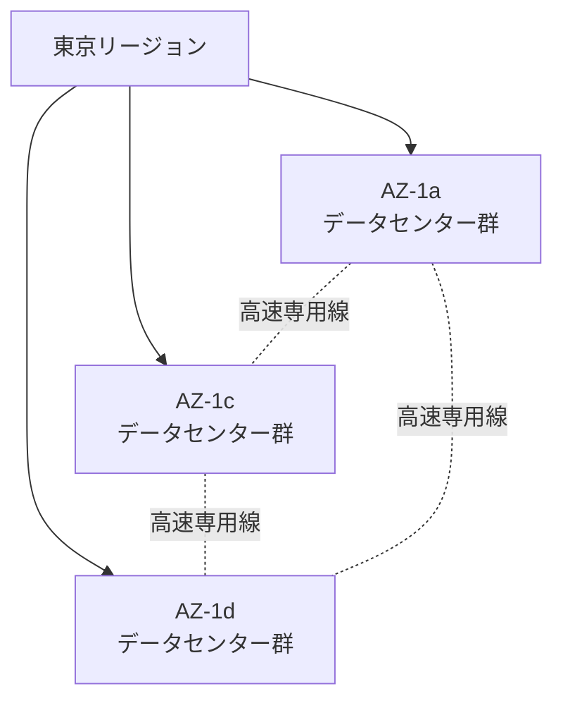
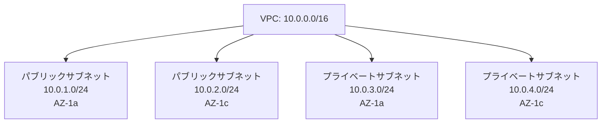
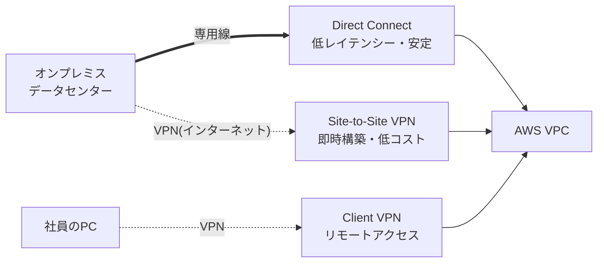

# 第1章: グローバルインフラ・ネットワーク基礎

> 所要時間の目安: 座学 30分 → ハンズオン 60〜75分 → 練習問題 20分

---

## 座学

---

## Part 1: AWSのグローバルインフラストラクチャ

AWSを使い始めるとき、最初に理解しておくべきことは「AWSのインフラがどこにあり、どう設計されているか」です。これを知らないまま設計を進めると、「なぜこのサービスはここで使えないのか」「可用性を上げるにはどうすればいいか」という判断ができなくなります。

**リージョンとアベイラビリティゾーン（AZ）** がAWSインフラの基本単位です。リージョンとは、地理的に離れた場所に設置されたデータセンター群のことで、「東京」「バージニア北部」「シンガポール」など世界各地に存在します。そして各リージョンの中には、必ず複数の**AZ（アベイラビリティゾーン）**があります。

AZが重要な理由は「独立性」にあります。同じリージョン内でも、各AZは物理的に数十km離れた場所に設置され、電源・ネットワーク・冷却設備がすべて独立しています。つまり、ある1つのデータセンターで火災や停電が起きても、他のAZには影響しない設計になっています。



この独立したAZを複数使う設計が**マルチAZ**です。例えばWebサーバーをAZ-1aとAZ-1cに1台ずつ置いておけば、AZ-1aで障害が起きてもAZ-1cのサーバーがリクエストを受け続けられます。SAAの試験では「可用性を高めるには?」という問いに対して、マルチAZ構成が正解になるケースが非常に多いです。

---

AWSのグローバルインフラには、リージョンとAZの他にも重要な概念があります。

**エッジロケーション**は、CloudFrontやRoute 53が使う配信拠点です。リージョンよりもずっと多くの都市に点在しており、ユーザーの近くでコンテンツをキャッシュしたりDNSクエリを処理したりすることで、低レイテンシーを実現します。東京のリージョンからシンガポールのユーザーにコンテンツを届けるより、シンガポールのエッジロケーションからキャッシュを返した方が速い、というイメージです。

**AWS Local Zones**は、特定のリージョンの「拡張」として、大都市の近くに設置される小規模なインフラです。ロサンゼルスやラスベガスなどに置かれており、その都市のユーザーに対して非常に低いレイテンシーでサービスを提供できます。「東海岸のリージョンからでは遅い、でも西海岸向けのLocal Zoneを使えば速い」というユースケースで使います。

**AWS Outposts**は、AWSのサーバーを物理的にお客様のオンプレミス環境に設置するサービスです。「AWSのサービスをデータセンターの外に出せない」という規制要件があるケースや、極めて低いレイテンシーが必要なケースで利用されます。Outpostsが入ったラックに対して、AWSと同じAPIでEC2やRDSを使えます。

---

## Part 2: VPCの基本設計

AWSでサービスを構築するとき、すべてのリソースは**VPC（Virtual Private Cloud）**の中に配置します。VPCとは、AWS上に作る「自分専用のプライベートネットワーク空間」のことです。

VPCを作るとき、まず決めるのが**IPアドレス範囲（CIDR）**です。例えば `10.0.0.0/16` というCIDRを指定すると、`10.0.0.0` から `10.0.255.255` までの約65,000個のIPアドレスを持つネットワークが作られます。一度作ったVPCのCIDRは変更できないため、最初はできるだけ大きなサイズ（/16）で作るのが推奨です。

VPCの中には**サブネット**を作ります。サブネットは、VPCのIPアドレス範囲をさらに分割した小さなネットワークで、**必ず1つのAZに紐づきます**。例えば `10.0.1.0/24` のサブネットをAZ-1aに、`10.0.2.0/24` のサブネットをAZ-1cに作ることで、マルチAZ構成の土台ができます。



サブネットには**パブリック**と**プライベート**の2種類があります。この区別は「インターネットゲートウェイへのルートがあるか否か」で決まります。

- **パブリックサブネット**: インターネットゲートウェイ（IGW）へのルートを持ち、インターネットと直接通信できる
- **プライベートサブネット**: IGWへのルートを持たず、インターネットから直接到達できない

Webサーバーや踏み台サーバーはパブリックサブネットに、データベースや内部APIサーバーはプライベートサブネットに置くのが基本パターンです。

---

**ルートテーブル**は、サブネット内のトラフィックをどこへ送るかを定義するものです。パブリックサブネットのルートテーブルには `0.0.0.0/0 → IGW` というルートが入っており、これが「インターネットへ出る経路」になります。プライベートサブネットのルートテーブルにはこのルートがなく、代わりに `0.0.0.0/0 → NATゲートウェイ` を設定することで、インターネットへのアウトバウンドだけを許可できます。

**セキュリティグループ**と**ネットワークACL（NACL）**は、どちらも通信を制御しますが、動作が異なります。

| | セキュリティグループ | ネットワークACL |
|---|---|---|
| 適用単位 | インスタンス（NIC）単位 | サブネット単位 |
| ステート | **ステートフル**（戻り通信自動許可） | **ステートレス**（戻り通信も明示許可が必要） |
| ルール | Allowのみ | Allow/Denyの両方 |

ステートフルとステートレスの違いは試験頻出です。セキュリティグループはステートフルなので、インバウンドでSSH（ポート22）を許可すれば、応答の戻り通信は自動的に許可されます。一方NACLはステートレスなので、インバウンドでポート22を許可しても、戻り通信（エフェメラルポート: 1024-65535）を別途アウトバウンドで許可しなければSSH接続できません。

---

## Part 3: AWSとオンプレミスの接続

企業がAWSを使うとき、既存のオンプレミス環境とAWSを接続するケースが多くあります。接続方法は主に3種類あります。

**AWS Direct Connect（DX）**は、オンプレミスのデータセンターとAWSを**専用線**で接続するサービスです。インターネットを経由しないため、安定した帯域幅と低レイテンシーを実現でき、セキュリティ面でも優れています。ただし、物理的な回線工事が必要なため、開通まで数週間〜数ヶ月かかります。大量のデータ転送が継続的に発生するケースや、厳格なセキュリティ要件があるケースで選ばれます。

**AWS Site-to-Site VPN**は、オンプレミスのネットワークとVPCをVPN接続するサービスです。インターネット経由ですがIPsecで暗号化されるため、安全な通信ができます。Direct Connectとは違い、ソフトウェアの設定だけで構築できるため、数時間で開通します。コストも低いですが、インターネット経由のため帯域や遅延はDirect Connectに劣ります。

**AWS Client VPN**は、個人のPC・スマートフォンとVPCをVPN接続するサービスです。Site-to-Site VPNが拠点間接続であるのに対して、Client VPNは「リモートワークの社員のPCをVPCに安全に接続する」用途です。



複数のVPCやDirect Connectを接続するための仕組みも重要です。

**Direct Connectゲートウェイ**を使うと、1本のDirect Connect接続から最大10個のVGW（仮想プライベートゲートウェイ）に接続できます。複数リージョンのVPCに1本の専用線で繋ぐ、といった構成が実現できます。

**AWS Transit Gateway**は、複数のVPCやDirect Connect、Site-to-Site VPNを**スター型トポロジー**で接続できるハブサービスです。VPCが5個あるとき、それぞれをペアリングすると最大10本の接続が必要ですが、Transit Gatewayを使えば5本（各VPC→TGW）で済みます。大規模な接続管理をシンプルにする仕組みです。

---

## 練習問題

---

# 問題1
あなたはソリューションアーキテクトとして、AWSを活用してEC2インスタンス上にデータベースサーバーを設定する役割を担っています。  
このデータベースには非常に重要な情報を保存するため、必要なパッチをダウンロードする場合を除き、インターネットから直接にデータベースサーバーに接続されないようにする必要があります。  
この要件を満たすためのAWSネットワーク設定はどれでしょうか。

## 選択肢
A. データベースをパブリックサブネット内に構築して、このプライベートサブネットのルートテーブルにインターネットゲートウェイ（IGW）へのルートを設定する。

B. データベースをパブリックサブネット内に構築して、このプライベートサブネットのルートテーブルにNATゲートウェイへのルートを設定する。

C. データベースをプライベートサブネット内に構築して、このプライベートサブネットのルートテーブルにインターネットゲートウェイ（IGW）へのルートを設定する。

D. データベースをプライベートサブネット内に構築して、このプライベートサブネットのルートテーブルにNATゲートウェイへのルートを設定する。

---

# 問題2
ある企業は、オンプレミス環境からAWSへの移行を決定しました。  
現在は火曜日であり、業務に影響を及ぼさないように、今週末の金曜日の夜から月曜日の朝までの72時間以内にデータ移行を完了させる必要があります。  
移行するデータの容量は10TBであり、データの安全な通信を確保することが求められています。  
現在、オンプレミス環境とVPCはインターネットを通じて接続されています。  
この条件に適した移行方法を選定してください。

## 選択肢
A. Snowball Edgeによるデータ移行を実施する。

B. Direct Connect接続によるデータ転送を実施する。

C. AWSサイト間VPNを利用したVPN接続によるデータ転送を実施する。

D. Storage Gatewayによるデータ移行を実施する。

---

# 問題3
あなたはソリューションアーキテクトとして、AWS上でアプリケーションを開発しています。  
このアプリケーションでは、VPCのパブリックサブネットにパブリックIPを持つLinuxのEC2インスタンスを配置しています。  
しかし、インターネット経由でSSHを使用してLinux EC2インスタンスに接続することができませんでした。  
EC2インスタンスが存在するVPC環境を確認したところ、次のような設定がなされていました。

- EC2インスタンスにはパブリックIPアドレスが割り当てられている
- セキュリティグループではSSHのインバウンドアクセスが許可されている
- サブネットのネットワークACLではSSHのインバウンドおよびアウトバウンドアクセスが許可されている（デフォルトのネットワークACLは利用されていない）
- パブリックサブネットにはインターネットゲートウェイへのルートが設定されている

インターネットからEC2インスタンスに接続するためには、追加でどのような手順を実施するべきでしょうか？

## 選択肢
A. ネットワークACLのアウトバウンド通信設定にエフェメラルポートへのアウトバウンド通信を許可するルールを追加する。

B. セキュリティグループにSSHのアウトバウンドのアクセスを許可するルールを追加する。

C. セカンダリーIPアドレスをEC2インスタンスに設定する。

D. パブリックサブネットのルートテーブルにNATゲートウェイへのルートを設定する。

---

# 問題4
ある企業はオンプレミス環境のインフラストラクチャをAWSに接続する計画をしています。  
その際は、低レイテンシーで可用性の高い安全な接続方法を必要としています。  
また、プライマリ接続障害時に冗長性を担保することが要件となっていますが、コストを最小限に抑えることが必要です。  
したがって、セカンダリの接続設定ではトラフィック転送速度のパフォーマンス低下は許容できます。  
この要件を満たすために、ソリューションアーキテクトはどうするべきでしょうか。

## 選択肢
A. オフィスネットワークとVPCをAWS Direct Connectで接続する。さらにプライマリDirect Connect接続に障害が発生した場合に備えて、VPN接続をバックアップとして構成する。

B. オフィスネットワークとVPCをAWS Direct Connectで接続する。さらにプライマリDirect Connect接続に障害が発生した場合に備えて、別リージョンのVPCに対するVPN接続をバックアップとして構成する。

C. オフィスネットワークとVPCを二重にAWS Direct Connectで接続する。さらにプライマリDirect Connect接続に障害が発生した場合に備えて、２つのDirect Connect接続を利用する。

D. オフィスネットワークとVPCを二重にAWS Direct Connectで接続する。さらにプライマリDirect Connect接続に障害が発生した場合に備えて、別リージョンのVPCに対する２つのDirect Connect接続を利用する。

---

# 問題5
あなたは新しくVPCを作成して、パブリックサブネットを2つ、プライベートサブネットを2つ設定しています。  
その際に、サブネット作成に対するCIDRの設定として200個のIPアドレスを利用できるようにする必要があります。  
最適なIPアドレス数となるCIDRのサブネットマスク設定を選択してください。

## 選択肢
A. /21  
B. /22  
C. /23  
D. /24

---

# 問題6
あなたはソリューションアーキテクトとして、ELBのターゲットグループにAuto Scalingグループを設定したLinux EC2インスタンス群にホストされたWEBアプリケーションを構築しています。  
EC2インスタンスはプライベートサブネットに設置して、更に別のプライベートサブネットにはAmazon RDS MySQL DBインスタンスを設置して、WEBサーバーからのデータ処理を行います。  
クライアントPCからプライベートサブネット内にあるWEBサーバーにアクセスして、ソフトウェアの更新を実施しようとしましたが、処理を実施できませんでした。  
この問題を解決するために考えられる対処方法を選択してください。（2つ選択してください。）

## 選択肢
A. NATゲートウェイをパブリックサブネットに設置して、プライベートサブネット内のWEBサーバーからインターネット側への返信を可能にする。

B. 新しいサブネットを設置してインターネットゲートウェイをルートテーブルに設定して、サブネット内に踏み台サーバーを設置する。

C. NATゲートウェイをプライベートサブネットに設置して、プライベートサブネット内のWEBサーバーからインターネット側への返信を可能にする。

D. NATインスタンスをプライベートサブネットに設置して、プライベートサブネット内のWEBサーバーからインターネット側への返信を可能にする。

E. WEBサーバーが設置されているプライベートサブネットにインターネットゲートウェイを設定する。

---

# 問題7
あなたはソリューションアーキテクトとして、VPCを新規に作成してEC2インスタンスを構成しようとしています。  
新たにVPCを1つ設置して、プライベートサブネットとパブリックサブネットを2つずつ構成しました。  
パブリックサブネットにEC2インスタンスを起動したところ、インスタンスがDNS名を受け取っていないことに気付きました。  
この原因として考えられる内容はどれでしょうか。

## 選択肢
A. サブネットのDNS hostnamesオプションが有効化されていない。

B. VPCのDNS hostnamesオプションが有効化されていない。

C. Route53のDNS hostnamesオプションが有効化されていない。

D. EC2インスタンスのDNS hostnamesオプションが有効化されていない。

---

# 問題8
あなたはソリューションアーキテクトとして、社内のレガシーシステムをクラウド化する案件に携わっています。  
このレガシーアプリケーションはマルチキャストネットワーキングに依存しており、AWSで確実に起動させるための特別な設定が必要です。  
この要件を満たすための方法を選択してください。

## 選択肢
A. VPC拡張ルーティングを有効化する。

B. VPC間でVPCピアリングを実施する。

C. AWS Transit Gatewayのマルチキャストを有効化する。

D. 仮想オーバレイネットワークをインスタンスのOSレベルで起動させる。

---

# 問題9
あるソリューションアーキテクトは新規にAWS上でアプリケーションを開発するために、ネットワークを設計しています。  
このネットワークは１つのVPCに対して、パブリックサブネットとプライベートサブネットを２つのアベイラビリティゾーンに１つずつ、合計で4つのサブネットを構成します。VPCとサブネットはIPv4 CIDRブロックを使用しています。  
インターネットゲートウェイを使用して、パブリックサブネットにインターネットアクセスを接続しています。  
プライベートサブネットには、Amazon EC2インスタンスがソフトウェアアップデートをダウンロードできるようにインターネットにアクセスできる必要があります。  
その際は、データセンター障害に強い構成にする必要があります。  
この要件を満たすために、ソリューションアーキテクトはどうすればよいでしょうか。

## 選択肢
A. 各AZのパブリックサブネットに１つずつNATゲートウェイを作成する。プライベートサブネットのトラフィックをNATゲートウェイに転送するルートテーブルを作成する。

B. 各AZのパブリックサブネットに１つずつNATインスタンスを作成する。プライベートサブネットのトラフィックをNATインスタンスに転送するルートテーブルを作成する。

C. １つのAZのパブリックサブネットに１つNATゲートウェイを作成する。プライベートサブネットのトラフィックをNATゲートウェイに転送するルートテーブルを作成する。

D. １つのAZのパブリックサブネットに１つNATインスタンスを作成する。プライベートサブネットのトラフィックをNATインスタンスに転送するルートテーブルを作成する。

---

# 問題10
ソリューションアーキテクトは1つのVPCに対して、２つのパブリックサブネットと２つのプライベートサブネットを利用したネットワークを構成しています。  
１つのプライベートサブネット内でAmazon EC2インスタンスを実行しました。このEC2インスタンスはインターネットを経由してバッチおよび更新プログラムをダウンロードする必要があります。これはできる限り安全に実施することが必要です。  
この要件を満たすために、ソリューションアーキテクトは何をするべきでしょうか。

## 選択肢
A. パブリックサブネットと、ウェブサイトがデプロイされているネットワークの間にサイト間VPNを作成する。

B. パブリックサブネットと、ウェブサイトがデプロイされているネットワークの間にゲートウェイエンドポイントを作成する。プライベートサブネットから送信されたトラフィックを、このゲートウェイエンドポイント経由でルーティングする。

C. パブリックサブネットにインターネットゲートウェイを作成する。プライベートサブネットから送信されたトラフィックを、このインターネットゲートウェイ経由でルーティングする。

D. パブリックサブネットにNATゲートウェイを作成する。プライベートサブネットから送信されたトラフィックを、このNATゲートウェイ経由でルーティングする。

---

## 問題解説

---

# 問題1 解説

## 正解: D

## 解説
要件は次の2点です。

- インターネットからデータベースへ直接接続できないこと
- OSパッチなどの取得のために、アウトバウンド通信のみは許可したいこと

この要件を満たす一般的なAWS設計は以下です。

- データベースはプライベートサブネットに配置する → パブリックIPを持たず、外部から直接到達できない
- プライベートサブネットのルートをNATゲートウェイへ向ける → アウトバウンド通信のみインターネットへ出られる

NATゲートウェイはインターネットからのインバウンド通信を受け付けないため、パッチ取得だけを許可しつつ、外部からの直接アクセスを防ぐ構成になります。

## 他の選択肢が不適切な理由
**A / B**: パブリックサブネットに配置すると、構成次第でインターネットから直接アクセス可能になるリスクがあり、要件を満たしません。

**C**: プライベートサブネットのルートテーブルにIGWへのルートを設定しても、パブリックIPを持たないインスタンスはIGW経由で通信できません。パッチ取得の目的にも適さない構成です。

---

# 問題2 解説

## 正解: C

## 解説
要件は以下の通りです。

- 移行期間は72時間以内（金曜夜〜月曜朝）
- データ容量は10TB
- 通信は安全である必要がある
- オンプレミスとVPCはすでにインターネット接続されている

これらを踏まえると、AWS サイト間 VPNを利用したデータ転送が最も現実的です。

- VPNはIPsecで暗号化され、安全な通信が可能
- 新たな物理機器の手配や回線工事が不要
- すぐに構築でき、短期間の移行に向いている
- 10TB程度であれば、72時間以内に転送可能なケースが多い

## 他の選択肢が不適切な理由
**A**: Snowball Edgeは物理デバイスの配送が必要なため、72時間という短期間の制約に合いません。

**B**: Direct Connectは専用線の敷設に時間がかかり、週末までに利用開始することは現実的ではありません。

**D**: Storage Gatewayは継続的なハイブリッド構成向けのサービスであり、短期間での一括データ移行用途には適していません。

---

# 問題3 解説

## 正解: A

## 解説
SSH接続では、クライアントからの通信はポート22宛に届きますが、サーバーからの戻り通信はエフェメラルポートを宛先として返されます。

ネットワークACLはステートレスであるため、

- インバウンドで22番ポートを許可する
- アウトバウンドでエフェメラルポート（例：1024–65535）を許可する

この両方が必要です。

今回の構成では、ネットワークACLでSSHのアウトバウンド通信（ポート22宛）は許可されていますが、エフェメラルポートへのアウトバウンド通信が許可されていないため、SSHの戻り通信が遮断され、接続できない状態になっています。

## 他の選択肢が不適切な理由
**B**: セキュリティグループはステートフルであり、インバウンドでSSHを許可していれば、戻り通信は自動的に許可されます。

**C**: セカンダリーIPアドレスはSSH接続可否とは無関係です。

**D**: パブリックサブネットにNATゲートウェイを設定する必要はありません。インターネットからの直接接続にはインターネットゲートウェイが必要です。

---

# 問題4 解説

## 正解: A

## 解説
要件を整理すると次の通りです。

- 通常時は低レイテンシーで安定した接続が欲しい
- 接続障害時の冗長性が必要
- コストは最小限にしたい
- セカンダリ側は性能低下が許容される

通常時の主経路はDirect Connectが最適です。専用線相当の接続で、インターネット経由より低レイテンシーで安定しやすく、通信も論理的に分離され運用上の信頼性が高いです。

ただしDirect Connectを二重化するとコストが増えます。バックアップ回線は性能低下を許容できるため、VPNをセカンダリにするのがコスト面で合理的です。

- プライマリ：Direct Connect
- セカンダリ：Site-to-Site VPN（インターネット経由、暗号化あり）

## 他の選択肢が不適切な理由
**B**: 別リージョンVPCへのVPNバックアップは設計・運用が複雑になります。要件は「接続の冗長性」であり「別リージョン冗長」は求められていません。

**C**: Direct Connectを二重化すると高可用性は上がりますが、コスト最小という要件に反します。

**D**: 二重Direct Connectに加えて別リージョンまで含めると、コスト・運用複雑性がさらに増します。

---

# 問題5 解説

## 正解: D（/24）

## 解説
AWSのサブネットでは、各サブネット内のIPv4アドレスから5個が予約されて利用できません。

- ネットワークアドレス（先頭）
- VPCルータ用（+1）
- DNS用（+2）
- 将来利用のため（+3）
- ブロードキャスト相当（末尾）

そのため、利用可能IP数は次の計算になります。

- **/24** は総IP数 256 → 利用可能IP数 **251**
- /23：総512 → 利用可能507
- /22：総1024 → 利用可能1019
- /21：総2048 → 利用可能2043

要件は「200個使える」であり、余分に大きいCIDRは無駄が増えるため、/24 が最小かつ要件を満たす正解です。

---

# 問題6 解説

## 正解: A・B

## 解説
WEBサーバーはプライベートサブネットに配置されているため、インターネットから直接アクセスできず、インターネットへのアウトバウンド通信もそのままではできません。ソフトウェア更新には以下の2つが必要です。

**A**: NATゲートウェイをパブリックサブネットに配置し、プライベートサブネットのルートをNATゲートウェイに向けることで、WEBサーバーはインターネットへのアウトバウンド通信が可能になります。これにより、OSやミドルウェアの更新が実行できます。

**B**: インターネットゲートウェイを持つパブリックサブネットに踏み台サーバーを配置することで、管理者は踏み台経由でプライベートサブネット内のWEBサーバーへ安全に接続できます。

## 他の選択肢が不適切な理由
**C**: NATゲートウェイはパブリックサブネットに配置する必要があります。プライベートサブネットに設置してもインターネットへ到達できません。

**D**: NATインスタンスもパブリックサブネットに配置する必要があります。

**E**: プライベートサブネットにインターネットゲートウェイを直接設定することはできません。

---

# 問題7 解説

## 正解: B

## 解説
EC2インスタンスにDNS名が付与されるかどうかは、VPC側のDNS設定に依存します。重要なのは **VPC の DNS hostnames** 設定です。これが無効だと、インスタンスにDNS名が割り当てられません。

## 他の選択肢が不適切な理由
**A**: サブネットに「DNS hostnames」というオプションはありません。サブネット側でよく混同される設定は「Auto-assign public IPv4 address」ですが、DNS名の付与そのものはVPC設定が決めます。

**C**: Route 53はDNSサービスですが、EC2インスタンスへ自動付与されるDNS名の有無を制御する設定はありません。

**D**: EC2インスタンス単体に「DNS hostnamesオプション」という設定はありません。

---

# 問題8 解説

## 正解: C

## 解説
AWSのVPCは、標準ではマルチキャスト通信をサポートしていません。この制約を公式に解決できる仕組みが、**AWS Transit Gatewayのマルチキャスト機能**です。

- Transit Gatewayでマルチキャストドメインを作成できる
- VPCやEC2インスタンスをマルチキャストドメインに関連付け可能
- AWSマネージドでマルチキャストルーティングが提供される

## 他の選択肢が不適切な理由
**A**: VPC拡張ルーティングはマルチキャスト通信を有効化する機能ではありません。

**B**: VPCピアリングはユニキャスト通信のみをサポートします。

**D**: OSレベルで仮想オーバレイネットワークを構築することは技術的に可能な場合もありますが、AWSが公式にサポートする方法ではなく、運用負荷も高くなります。

---

# 問題9 解説

## 正解: A

## 解説
要件は「プライベートサブネットのEC2がインターネットへアウトバウンド通信できること」かつ「AZ障害に強いこと」です。

NATゲートウェイはAZ内のサービスです。1つのAZにだけNATゲートウェイを置くと、そのAZに障害が起きた際にもう片方のAZのプライベートサブネットからのアウトバウンド経路も失われる可能性があります。

そのため、各AZのパブリックサブネットにNATゲートウェイを1つずつ配置し、各AZのプライベートサブネットは同一AZ内のNATゲートウェイへルーティングする構成が推奨されます。

- AZ-Aのプライベートサブネット → AZ-AのNATゲートウェイ
- AZ-Bのプライベートサブネット → AZ-BのNATゲートウェイ

## 他の選択肢が不適切な理由
**B**: NATインスタンスでも実現は可能ですが、パッチ適用・スケール・冗長化・監視など運用負荷が高くなります。マネージドなNATゲートウェイが適切です。

**C**: NATゲートウェイが1つのAZにしかないと、AZ障害時にアウトバウンド経路が失われ、「データセンター障害に強い」要件を満たしません。

**D**: 単一AZのNATインスタンスは単一障害点になり、運用負荷も高くなります。

---

# 問題10 解説

## 正解: D

## 解説
要件は以下です。

- EC2はプライベートサブネットにある（インターネットから直接到達させない）
- インターネット経由で更新プログラム等をダウンロードしたい（アウトバウンドは必要）
- できる限り安全に実施したい

プライベートサブネットのインスタンスがインターネットへ出るための経路として、NATゲートウェイを使うのが標準的な設計です。

- NATゲートウェイはパブリックサブネットに配置する
- プライベートサブネットのルートテーブルで 0.0.0.0/0 をNATゲートウェイに向ける
- インスタンスはアウトバウンド通信で外部に出られる
- 外部からインスタンスへのインバウンド接続はできない

## 他の選択肢が不適切な理由
**A**: サイト間VPNはオンプレミスなど別ネットワークとの安全な接続に使うものであり、インターネット上の更新サイトへアクセスするための構成としては目的が違います。

**B**: ゲートウェイエンドポイントは主にS3やDynamoDB向けであり、一般的なインターネット上の更新サイトへのアクセス経路としては使えません。

**C**: プライベートサブネットからIGWへ直接ルーティングする設計は適切ではありません。プライベート側のインスタンスはパブリックIPを持たないため、そのままではIGW経由で通信できません。

---

## ハンズオン

> **所要時間の目安**: 全体で約60〜75分（ハンズオン①: 15分、ハンズオン②: 45〜60分）

> **注意事項**
> - ハンズオン終了後は手順書末尾の「リソース削除」セクションに従い、指定されたリソースを削除してください（コスト発生防止）。一部のリソースは次回以降のハンズオンで再利用します。
> - **各サービスの操作を始める前に、コンソール右上のリージョンが「東京（ap-northeast-1）」になっていることを必ず確認してください**

---

## ハンズオン①：コンソール基本操作・MFA・予算アラート設定

### このハンズオンで学ぶこと
- AWSマネジメントコンソールの基本操作とMFA設定によるアカウントセキュリティ強化
- AWS Budgetsによるコスト管理とアラート設定

### MFA設定

1. AWSマネジメントコンソールにサインイン
2. 右上のアカウント名をクリック →「セキュリティ認証情報」を選択
3. 「多要素認証（MFA）」セクション →「MFAデバイスの割り当て」をクリック
4. デバイス名を入力（例: `my-mfa-device`）
5. 「認証アプリケーション」を選択 →「次へ」
6. 「QRコードを表示」をクリック → スマホの認証アプリ（Google Authenticator等）でスキャン
7. 認証アプリに表示されるコードを「MFAコード1」に入力 → 30秒待って次のコードを「MFAコード2」に入力
8. 「MFAを追加」をクリック

### 予算アラート（Budgets）設定

1. コンソール上部の検索バーに「Budgets」と入力 →「AWS Budgets」を選択
2. 「予算を作成」をクリック
3. 「カスタマイズ（アドバンスト）」→「コスト予算」を選択 →「次へ」
4. 以下を入力：
   - 予算名: `monthly-budget`
   - 期間: 月別
   - 予算額: `10`（USD）
5. 「次へ」→ アラートしきい値の追加:
   - しきい値: `80`%（実績コスト）
   - Eメール受信者: 自分のメールアドレスを入力
6. 「次へ」→「予算を作成」をクリック

---

## ハンズオン②：VPCピアリング接続

### このハンズオンで学ぶこと
- VPC、サブネット、IGW、ルートテーブルによるネットワーク基盤の構築
- VPCピアリング接続による異なるVPC間の通信
- セキュリティグループによるトラフィック制御
- EC2インスタンスへのSSH接続と疎通確認

### リソース状況
- **新規作成（継続利用）**: VPC-A、VPC-A-Public、IGW-A、SG-VPC-A、EC2-A
- **新規作成（削除対象）**: VPC-B、VPC-B-Public、IGW-B、SG-VPC-B、EC2-B、VPC-A-to-B

### ステップ1: VPC-Aを作成

1. コンソール上部の検索バーに「VPC」と入力 →「VPC」を選択
2. 左メニュー「お使いのVPC」→「VPCを作成」をクリック
3. 以下を入力：
   - 「VPCのみ」を選択
   - 名前タグ: `VPC-A`
   - IPv4 CIDR: `10.0.0.0/16`
4. 「VPCを作成」をクリック

### ステップ2: VPC-Bを作成

1. 同様に「VPCを作成」をクリック
2. 以下を入力：
   - 「VPCのみ」を選択
   - 名前タグ: `VPC-B`
   - IPv4 CIDR: `10.1.0.0/16`

### ステップ3: サブネットを作成

1. 左メニュー「サブネット」→「サブネットを作成」
2. VPC-A用サブネット:
   - VPC: `VPC-A`、サブネット名: `VPC-A-Public`、AZ: `ap-northeast-1a`、CIDR: `10.0.1.0/24`
3. VPC-B用サブネット:
   - VPC: `VPC-B`、サブネット名: `VPC-B-Public`、AZ: `ap-northeast-1a`、CIDR: `10.1.1.0/24`

### ステップ4: インターネットゲートウェイを作成・アタッチ

1. 左メニュー「インターネットゲートウェイ」→「インターネットゲートウェイの作成」
2. 名前タグ: `IGW-A` → 作成後「VPCにアタッチ」→ `VPC-A` を選択
3. 同様に `IGW-B` を作成 → `VPC-B` にアタッチ

### ステップ5: ルートテーブルにインターネットルートを追加

1. 左メニュー「ルートテーブル」→ `VPC-A` に関連付けられたルートテーブルを選択
2. 「ルート」タブ →「ルートを編集」→「ルートを追加」
   - 送信先: `0.0.0.0/0`、ターゲット: `IGW-A`
3. 「サブネットの関連付け」タブ → `VPC-A-Public` にチェック
4. `VPC-B` のルートテーブルも同様に設定

### ステップ6: セキュリティグループを設定

1. `SG-VPC-A` を作成（VPC: `VPC-A`）
   - インバウンド: SSH（`0.0.0.0/0`）、すべてのICMP-IPv4（`10.1.0.0/16`）
2. `SG-VPC-B` を作成（VPC: `VPC-B`）
   - インバウンド: SSH（`0.0.0.0/0`）、すべてのICMP-IPv4（`10.0.0.0/16`）

### ステップ7: EC2インスタンスを起動

1. `EC2-A`（VPC-A、VPC-A-Public、SG-VPC-A、パブリックIP有効）を起動
2. `EC2-B`（VPC-B、VPC-B-Public、SG-VPC-B、パブリックIP有効）を起動

### ステップ8: SSHキーペアの準備

**Mac**:
```bash
mv ~/Downloads/handson-key.pem ~/.ssh/
chmod 400 ~/.ssh/handson-key.pem
```

**Windows (PowerShell)**:
```powershell
mkdir $env:USERPROFILE\.ssh -Force
move $env:USERPROFILE\Downloads\handson-key.pem $env:USERPROFILE\.ssh\
icacls $env:USERPROFILE\.ssh\handson-key.pem /inheritance:r /grant:r "$($env:USERNAME):(R)"
```

### ステップ9: VPCピアリング接続を作成

1. VPCコンソール → 左メニュー「ピアリング接続」→「ピアリング接続を作成」
2. 名前タグ: `VPC-A-to-B`、リクエスタVPC: `VPC-A`、アクセプタVPC: `VPC-B`
3. 作成後「アクション」→「リクエストを承諾」

### ステップ10: ルートテーブルにピアリングルートを追加

1. `VPC-A` のルートテーブルに追加: 送信先 `10.1.0.0/16` → ターゲット `VPC-A-to-B`
2. `VPC-B` のルートテーブルに追加: 送信先 `10.0.0.0/16` → ターゲット `VPC-A-to-B`

### ステップ11: 疎通確認

1. `EC2-A` にSSH接続:
   ```bash
   ssh -i ~/.ssh/handson-key.pem ec2-user@<EC2-AのパブリックIP>
   ```
2. `EC2-B` のプライベートIPをEC2コンソールで確認
3. `EC2-A` から ping を実行:
   ```bash
   ping 10.1.1.xx
   ```
4. **確認**: 応答が返ってくればピアリング接続成功

### リソース削除

> **注意**: `VPC-A`・`VPC-A-Public`・`IGW-A`・`SG-VPC-A`・`EC2-A` は第2章以降で再利用します。**削除しないでください。**

1. `EC2-B` を終了
2. VPCピアリング接続 `VPC-A-to-B` を削除
3. `IGW-B` をデタッチ → 削除
4. `VPC-B-Public` を削除
5. `SG-VPC-B` を削除
6. `VPC-B` を削除

> `EC2-A` は次回まで「停止」しておくとコストを抑えられます（「終了」はしないでください）。
