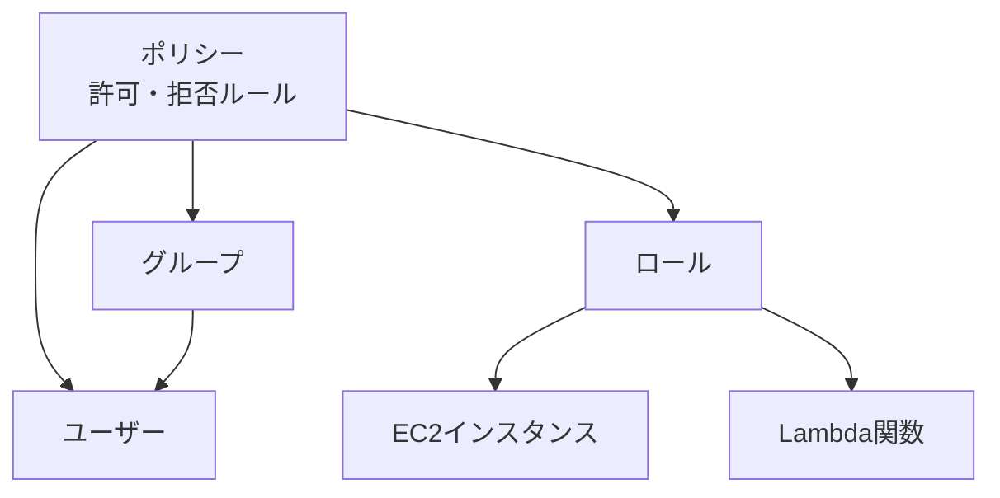

# 第2章: IAM・ガバナンス・セキュリティサービス

> 所要時間の目安: 座学 30分 → ハンズオン 60分 → 練習問題 20分

---

## 座学

---

## Part 1: IAMとは何か

AWSを使うすべての人・サービスは、**IAM（Identity and Access Management）**を通じて「誰が」「何を」「できるか」を制御します。IAMはAWSのアクセス管理の中心であり、正しく理解していないとセキュリティインシデントの原因になります。

IAMには4つの主要概念があります。**ユーザー**は個人を表すアイデンティティです。**グループ**は複数ユーザーをまとめて管理するための器で、グループにポリシーをアタッチすると、メンバー全員に適用されます。**ロール**は「人」ではなく「AWSサービスや外部アイデンティティ」に割り当てるアイデンティティです。EC2インスタンスがS3にアクセスするとき、インスタンスにロールを付与します。**ポリシー**は「何が許可・拒否されるか」を定義するJSON文書です。



**最小権限の原則**がIAM設計の基本です。「必要な権限だけを付与し、それ以上は与えない」。管理者だからといってすべての権限を常に持つのではなく、必要なときに必要なロールに切り替える設計が推奨されます。

---

## Part 2: IAMポリシーの評価ロジック

IAMポリシーには**マネージドポリシー**（AWSが管理するもの・ユーザーが作るもの）と**インラインポリシー**（特定のユーザー・グループ・ロールに直接埋め込むもの）があります。

ポリシーの評価ロジックは試験頻出です。基本ルールは以下の通りです。

1. **デフォルトはすべて拒否（Deny）**
2. **明示的なAllowがあれば許可**
3. **明示的なDenyがあれば、Allowより優先されて拒否**

つまり、誰かに権限を与えるには明示的にAllowを書く必要があり、拒否したい操作には明示的にDenyを書けば確実に遮断できます。

---

## Part 3: セキュリティサービス

AWSには複数のセキュリティ・監査サービスがあります。それぞれの目的と使い分けを押さえましょう。

**AWS CloudTrail**はAWSアカウント内のすべてのAPI呼び出しを記録するサービスです。「誰が」「いつ」「何のAPI」を実行したかがログとして残ります。セキュリティインシデント発生時の調査や、コンプライアンス監査に使います。

**AWS Config**はAWSリソースの設定変更を追跡し、設定が特定のルールに準拠しているかを評価するサービスです。「S3バケットがパブリックアクセスを許可していないか」「EC2インスタンスに特定のタグがついているか」といったルールを定義して、継続的に監視できます。

**Amazon GuardDuty**はVPCフローログ・CloudTrailログ・DNSログを機械学習で分析し、異常な振る舞い（不審なAPIコール、マルウェアの可能性のある通信など）を検知する脅威検知サービスです。有効化するだけで自動的に監視が始まります。

**AWS Security Hub**は複数のセキュリティサービス（GuardDuty、Config、Inspector等）の結果を集約して、一元的に管理するダッシュボードです。

| サービス | 目的 |
|---------|------|
| CloudTrail | APIの操作ログを記録 |
| Config | リソース設定の変更追跡・コンプライアンス評価 |
| GuardDuty | 脅威・異常検知（機械学習） |
| Security Hub | セキュリティ結果の一元管理 |

---

## Part 4: データ保護

**AWS KMS（Key Management Service）**は暗号化キーの作成・管理・利用を行うサービスです。S3・EBS・RDS・Lambda等多くのAWSサービスと統合されており、「サーバーサイド暗号化」を有効にするとKMSのキーでデータが暗号化されます。

**AWS Secrets Manager**はデータベースのパスワードやAPIキーなどのシークレット情報を安全に保存・管理し、自動ローテーションも行えるサービスです。アプリケーションのコードにパスワードをハードコードする代わりに、Secrets Managerから動的に取得する設計が推奨されます。

---

## 練習問題

---

# 問題1
ある企業は、AWS上でホストされている一連のアプリケーションの運用を行っています。  
この企業では、アプリケーション間の連携を実現するためにAPI Gatewayを導入することに決定しました。  
そのため、API Gatewayにおける権限管理を行い、API呼び出し時にAPIコール元に対して適切なアクセス権限を設定する必要があります。  
この要件を満たすためのAPI Gatewayの最も適切な設定方法はどれでしょうか。

## 選択肢
A. AWS STSを利用して、APIコールの呼び出し元に対して権限を付与する。

B. IAMポリシーを利用して、APIコールの呼び出し元に対して権限を付与する。

C. AWS Configを利用して、APIコールの呼び出し元に対して権限を付与する。

D. IAMアクセスキーを利用して、APIコールの呼び出し元に対して権限を付与する。

---

# 問題2
次のIAMポリシーでEC2インスタンスに対する権限設定を行っています。

```json
{
  "Version": "2012-10-17",
  "Statement": [
    {
      "Action": "ec2:*",
      "Effect": "Allow",
      "Resource": "*"
    },
    {
      "Effect": "Deny",
      "Action": [
        "ec2:*ReservedInstances*",
        "ec2:TerminateInstances"
      ],
      "Resource": "*"
    }
  ]
}
```

この設定内容として正しい内容を選択してください。

## 選択肢
A. リザーブドインスタンスの操作が許可されている。

B. EC2インスタンスに対する全ての操作が許可されている。

C. 全てのEC2インスタンスを終了することができない。

D. 全てのリザーブドインスタンスに対してのみインスタンスを終了することができない。

---

# 問題3
次のSCPで特定のOUに対してAWSリソースに対する権限範囲の設定を行っています。このOUには他にSCPは付与されていません。

```json
{
    "Version": "2012-10-17",
    "Statement": [
        {
            "Effect": "Allow",
            "Action": [
                "ec2:*",
                "iam:*",
                "cloudwatch:*"
            ],
            "Resource": "*"
        }
    ]
}
```

この設定内容として正しい内容を選択してください。

## 選択肢
A. このSCPを設定したOUのメンバーアカウント内の全てのユーザーはEC2の全ての権限を有している。

B. このSCPを設定したOUのメンバーアカウントはEC2とCloudWatchのフルアクセス権限を設定することが可能である。

C. このSCPを設定したOUのメンバーアカウント内の全てのユーザーはEC2の全ての権限を有していない。

D. このSCPを設定したOUのメンバーアカウントはEC2とCloudWatchのフルアクセス権限を設定することができない。

---

# 問題4
次のIAMポリシーでAWSリソースに対する権限設定を行っています。

```json
{
    "Version": "2012-10-17",
    "Statement": [
        {
            "Effect": "Deny",
            "Action": "*",
            "Resource": "*",
            "Condition": {
                "NotIpAddress": {
                    "aws:SourceIp": [
                        "172.101.1.36/32"
                    ]
                }
            }
        }
    ]
}
```

この設定内容として正しい内容を選択してください。

## 選択肢
A. IPアドレス（172.101.1.36）以外は全てのリソースのアクセス権限を拒否されている。

B. IPアドレス（172.101.1.36）は全てのリソースのアクセス権限を有している。

C. IPアドレス（172.101.1.36）以外は全てのリソースのアクセス権限を有している。

D. IPアドレス（172.101.1.6）は全てのリソースのアクセス権限を有している。

---

# 問題5
ある企業はAWS上でウェブアプリケーションを運営しています。  
このアプリケーションはEC2インスタンスをWEBサーバーとして活用し、ELBおよびAuto Scalingグループを構成して高い可用性を確保しています。  
また、ELBに対してRoute53を利用したドメインも設定しています。  
しかしながら、最近、長時間にわたるDDoS攻撃を受け、リクエストにかかるコストが増大しました。  
あなたはソリューションアーキテクトとして、このDDoS攻撃によるコスト増加を抑制する必要があります。  
この要件を満たすために、ソリューションアーキテクトはどのような手段を講じるべきでしょうか。

## 選択肢
A. AWSサポートのDDoS攻撃コストプランを適用する。

B. AWS Shield Advancedを適用する。

C. Amazon GuardDutyを適用する。

D. AWS Shield Standardを適用する。

---

# 問題6
ある企業は、AWS上でWEBアプリケーションを運用しています。  
このアプリケーションは、Amazon RDS MySQLのマルチAZ配置のデータベースインスタンスと、EC2インスタンスを基盤としたWEBサーバーで構成されています。  
ソリューションアーキテクトは、現在のデータベース認証方式が安全性に欠けるため、セキュリティ設定の強化を求められました。  
ユーザーの認証情報を自動的にローテーションし、WEBサーバーからのデータベース接続を安全に保つ必要があります。  
この要件を達成するために、ソリューションアーキテクトはどのような対策を講じるべきでしょうか。

## 選択肢
A. ユーザー認証情報をAWS Secrets Managerのシークレットに保存する。IAMアクセス許可を付与して、EC2インスタンスによるAWS Secrets Managerへのアクセスを許可する。

B. データベースユーザー認証機能をAWS Systems Managerパラメーターストアに保存する。IAMアクセス許可を付与して、EC2インスタンスによるOpsCenterへのアクセスを許可する。

C. ユーザー認証情報をAWS Secrets Managerパラメーターストアに保存する。IAMアクセス許可を付与して、EC2インスタンスによるパラメーターストアへのアクセスを許可する。

D. ユーザー認証情報をAWS Systems Managerパラメーターストアに保存する。IAMアクセス許可を付与して、EC2インスタンスによるOpsCenterへのアクセスを許可する。

---

# 問題7
ある企業が、AWSを利用したデータ共有システムを構築しています。このシステムでは、機密データをAmazon S3バケットに保存します。コンプライアンス上の理由により、保管中のデータを暗号化することが必須となります。その際は、セキュリティを高めるために暗号用のキーをロギングしつつ、毎年ローテーションする必要があります。その際は、管理者がキーの操作権限を有した上で、運用の手間をできる限り省略してコスト最適化する必要があります。  
最も費用対効果が高いソリューションはどれでしょうか。

## 選択肢
A. 顧客提供のキーを使用したサーバーサイド暗号化を実施する。キーは1年に一回ローテーションを実施する。

B. Amazon S3マネージドキーを使用したサーバーサイド暗号化を実施する。キーはAWS側でローテーションされる。

C. AWS KMSキーを使用したサーバーサイド暗号化を実施する。キーには自動ローテーションを設定する。

D. AWS KMSキーを使用したサーバーサイド暗号化を実施する。キーは1年に一回ローテーションを実施する。

---

# 問題8
ある企業では、AWS上で運用されているアプリケーションがあります。  
このアプリケーションは、2つのパブリックサブネットにそれぞれ配置された2台のEC2インスタンスを使用しています。  
WEBサーバーには、インターネットを介して社内の特定のユーザーのみがアクセス可能です。  
もう1台のインスタンスはデータベースサーバーとして機能しています。  
あなたはセキュリティ担当者として、現在のアーキテクチャのセキュリティ強化を検討しています。  
次の中で、最もセキュリティが高いアーキテクチャ構成はどれでしょうか。

## 選択肢
A. 新しくプライベートサブネットを作成して、そこにNATインスタンスを設置する。社内ネットワークとVPNを構成して、プライベートサブネットに接続する。

B. WEBサーバーのみプライベートサブネットに移動する。社内ネットワークとVPNを構成して、プライベートサブネットに接続する。

C. データベースサーバーのみプライベートサブネットに移動する。社内ネットワークとVPNを構成して、プライベートサブネットに接続する。

D. 両方のサーバーを新しいプライベートサブネットに移行して、パブリックサブネットに踏み台サーバーを設定する。社内ネットワークとVPNを構成して、プライベートサブネットに接続する。

---

# 問題9
製造業のA社はAWS上にエンタープライズシステムをホストしています。最近になって、そのシステムが突如停止するという障害が発生しました。ソリューションアーキテクトが調査したところ、一人のエンジニアが本番環境のEC2インスタンスを誤って終了してしまい、サービス中断を引き起こしたことが判明しました。また、実稼働するアプリケーション向けのインフラ構成を操作できる開発者が多数存在するという事実も同時に判明しました。  
この種の障害が再び発生するのを防ぐための、適切な対応はどれでしょうか？（2つ選択してください。）

## 選択肢
A. すべてのEC2インスタンスに適切なタグ設定を行い、タグ情報に基づいて本番環境向けインスタンスの削除を拒否する権限を設定する。それによって、開発者の権限を所属するグループタグ内でのリソース操作に限定する。

B. 開発者向けのIAMポリシーを修正して、EC2インスタンスの停止権限の許可ポリシーを削除する。

C. 開発者グループのIAMグループのIAMポリシーを修正して、EC2インスタンスへの操作権限を削除する。

D. AWS Organizationsを利用して開発者グループとそれ以外を分割する組織ルールを適用して、開発者がアクセスできるインスタンスを制限する。

E. 開発環境向けのVPCを新たに設置して、開発者のアクセス権限を開発者向けVPC内に制限する。その上で、IAMポリシーによってVPCごとに権限設定を割り振ることで、開発者グループが利用できるVPC内リソースを制限する。

---

# 問題10
A社では社内アプリケーションに対するDDoS攻撃によって大規模なシステム障害が発生しました。そこで、あなたはソリューションアーキテクトとして、AWS上にホストしている自社アプリケーションを保護するためにDDoS攻撃などの外部攻撃を軽減するアーキテクチャを設定するように依頼されました。具体的に防止するべき攻撃リストは以下の通りです。

- DDoS攻撃
- SYNフラッド
- UDPリフレクション攻撃
- SQLインジェクション
- クロスサイトスクリプティング

これらの要件を満たす、AWSアーキテクチャ設計パターンを選択してください。（3つ選択してください。）

## 選択肢
A. AWS Shield Standardを利用して高度なDDoS攻撃及びSYNフラッドやUDPリフレクション攻撃を検出して、アプリケーションレイヤー上のリアルタイム通知を実施する。

B. Amazon Route 53 のシャッフルシャーディングとanycastルーティング機能により、DDoS攻撃を回避して、エンドユーザーがアプリケーションにアクセスできるようにする。

C. AWS Shield Standardを利用して、SQLインジェクション、クロスサイトスクリプティング攻撃などを検出して、アプリケーションレイヤー上のリアルタイム通知を実施する。

D. AWS Shield Advancedを利用して高度なDDoS攻撃を検出して、アプリケーションレイヤー上のモニタリングを実施する。

E. AWS WAFを利用してセキュリティルールをカスタマイズして、アプリケーションに対するトラフィックを制御する。

---

## 問題解説

---

# 問題1 解説

## 正解: B

## 解説
API GatewayでAPIコール元のアクセス権限を管理するには、IAM認証（IAM Authorization）が最も適切です。

- APIの呼び出し元（IAMユーザー、IAMロール）に対してIAMポリシーで `execute-api:Invoke` を許可する
- 署名付きリクエスト（SigV4）によって呼び出し元が認証される

## 他の選択肢が不適切な理由
**A**: STSは一時クレデンシャルを発行する仕組みであり、権限そのものの定義はIAMポリシーで行います。

**C**: AWS Configはリソース設定の変更履歴・評価を行うサービスであり、API呼び出し元の認可には使いません。

**D**: IAMアクセスキーは認証情報の一種であり、権限管理の仕組みそのものではありません。長期的なアクセスキーの配布は漏洩リスクがあり、ベストプラクティスではありません。

---

# 問題2 解説

## 正解: C

## 解説
IAMポリシー評価の重要なポイント: **明示的なDenyはAllowより優先されます。**

このポリシーでは、1つ目のStatementで `ec2:*` をAllowしていますが、2つ目のStatementで `ec2:*ReservedInstances*` と `ec2:TerminateInstances` が明示的にDenyされています。

そのため、`ec2:TerminateInstances` が明示的に拒否されているため、すべてのEC2インスタンスを終了することはできません。

## 他の選択肢が不適切な理由
**A**: リザーブドインスタンス関連操作は明示的にDenyされているため、許可されていません。

**B**: TerminateInstancesとReservedInstances系アクションがDenyされているため、「すべての操作が許可」ではありません。

**D**: TerminateInstances自体が拒否されているため、通常のEC2インスタンスも終了できません。

---

# 問題3 解説

## 正解: B

## 解説
SCPの重要なポイント:

- SCPは権限の**上限（境界）**を定義するものであり、直接権限を付与するものではない
- SCPでAllowされていても、実際にアクセスするにはIAMポリシーで別途権限を付与する必要がある

このSCPでは `ec2:*`、`iam:*`、`cloudwatch:*` がAllowされています。そのため、メンバーアカウントはEC2・IAM・CloudWatchについて、IAMポリシーでフルアクセス権限を設定することが可能です。

## 他の選択肢が不適切な理由
**A**: SCPは直接ユーザーに権限を付与しません。IAMポリシーで別途許可が必要です。

**C**: SCPでec2:*がAllowされているため、IAMポリシーでEC2権限を付与すれば利用可能です。

**D**: SCPでec2:*とcloudwatch:*がAllowされているため、設定することは可能です。

---

# 問題4 解説

## 正解: A

## 解説
このポリシーの意味:「送信元IPアドレスが 172.101.1.36 ではない場合、すべてのアクションを拒否する」

つまり、172.101.1.36 以外のIPアドレスからのアクセスはすべて拒否される、ホワイトリスト型の制御です。

## 他の選択肢が不適切な理由
**B**: このポリシー単体では172.101.1.36に対してAllowを与えているわけではありません。「Denyしない」だけであり、実際にアクセスできるかは別途AllowポリシーとIAMポリシーが必要です。

**C**: 条件は NotIpAddress なので、172.101.1.36以外は拒否されます。

**D**: 指定されているIPは 172.101.1.36 であり、172.101.1.6 ではありません。

---

# 問題5 解説

## 正解: B

## 解説
要件は「DDoS攻撃によるコスト増加を抑制する」です。**AWS Shield Advanced**は以下を提供します。

- L3/L4 DDoS防御の強化
- Route 53、CloudFront、ALB/NLBなど主要エッジ/フロントの保護
- DDoS Response Team（DRT）による支援
- DDoSに関連するコスト増加への保護

## 他の選択肢が不適切な理由
**A**: 「AWSサポートのDDoS攻撃コストプラン」という独立した適用策は一般的な設計解として扱われません。

**C**: GuardDutyは脅威検知サービスであり、DDoSトラフィックをブロックしたりコスト増を抑える機能ではありません。

**D**: Shield Standardは基本的なDDoS防御を自動提供しますが、コスト増大の抑制やDRT支援が不足します。

---

# 問題6 解説

## 正解: A

## 解説
**AWS Secrets Manager**はRDS（MySQLを含む）向けのシークレット管理と自動ローテーション機能を提供します。

運用イメージ:
- Secrets ManagerにDB認証情報をシークレットとして保存
- ローテーション機能で認証情報を自動更新
- EC2にはIAMロールでSecrets Manager参照権限を付与
- アプリケーションは実行時にSecrets Managerから認証情報を取得

## 他の選択肢が不適切な理由
**B / D**: Systems Managerパラメーターストアは秘匿情報保管には使えますが、RDS向けの自動ローテーションを標準機能として提供するのはSecrets Managerです。OpsCenterは運用問題管理であり、認証情報取得先としては不適切です。

**C**: 「AWS Secrets Managerパラメーターストア」というサービスは存在しません。

---

# 問題7 解説

## 正解: C

## 解説
**AWS KMSキー（カスタマーマネージドキー）によるSSE-KMS**は以下を提供します。

- キーの使用履歴をCloudTrailでロギング可能
- 自動ローテーション機能により毎年のキーローテーションを自動化
- IAMポリシーとキーポリシーで管理者のキー操作権限を細かく制御可能
- AWSマネージドサービスのため運用負荷が低い

## 他の選択肢が不適切な理由
**A**: 顧客提供のキー（SSE-C）は管理・ローテーションをすべて自社で行う必要があり、運用負荷が高いです。

**B**: S3マネージドキー（SSE-S3）はAWSが完全管理するため、管理者がキーの操作権限を持てません。

**D**: KMSキーを使う点は正しいですが、手動ローテーションは「運用の手間を省略」という要件に反します。

---

# 問題8 解説

## 正解: D

## 解説
「最もセキュリティが高い」構成の基本は、インターネットから到達可能な範囲（アタックサーフェス）を最小化することです。

Dの構成では:
- WEBサーバーもDBサーバーもプライベートサブネットへ移す（どちらもインターネットから直接到達不可）
- 管理アクセスは踏み台サーバー経由に限定
- 社内ネットワークからはSite-to-Site VPNでVPCへ接続

## 他の選択肢が不適切な理由
**A**: NATインスタンスは主にアウトバウンド通信のための仕組みであり、サーバー配置の設計としては主旨がずれます。

**B**: WEBサーバーをプライベートに移しても、DBサーバーがパブリックに残るため重要データへのリスクが残ります。

**C**: DBをプライベートへ移すのは重要な改善ですが、WEBサーバーがパブリックのままだと攻撃面が残ります。

---

# 問題9 解説

## 正解: A・E

## 解説
開発者の業務に必要な権限は維持しつつ、本番環境を保護する方法を選ぶことがポイントです。

**A（タグベースのアクセス制御）**: EC2インスタンスに環境タグ（例: `Environment=Production`）を設定し、IAMポリシーのConditionでタグに基づいた制御を行います。開発者は開発環境のインスタンスは自由に操作でき、本番環境のインスタンスは保護されます。

**E（VPCによる環境分離）**: 本番環境と開発環境をVPCレベルで分離し、開発者は開発用VPC内のリソースのみ操作可能にします。ネットワークレベルでの分離により誤操作リスクを低減できます。

## 他の選択肢が不適切な理由
**B**: EC2インスタンスの停止権限を完全に削除すると、開発環境のインスタンスも停止できなくなります。

**C**: EC2への操作権限をすべて削除すると、開発者は開発業務自体ができなくなります。

**D**: AWS Organizationsはアカウント単位の管理サービスであり、同一アカウント内のユーザーグループ分割には使いません。

---

# 問題10 解説

## 正解: B・D・E

## 解説
ネットワーク層の攻撃とアプリケーション層の攻撃に対して、それぞれのサービスが守備範囲を分担します。

**B（Route 53のシャッフルシャーディングとanycastルーティング）**: DDoS攻撃の影響範囲を限定し、攻撃中でもエンドユーザーのアクセスを維持できます。

**D（AWS Shield Advanced）**: 高度なDDoS攻撃、SYNフラッド、UDPリフレクション攻撃を検出・防御します。アプリケーションレイヤーのモニタリングとDRT支援も提供します。

**E（AWS WAF）**: SQLインジェクションやクロスサイトスクリプティングなど、アプリケーション層の攻撃を防御します。

## 他の選択肢が不適切な理由
**A**: Shield Standardは高度な攻撃の検出やリアルタイム通知機能がありません。高度なDDoS対応にはShield Advancedが必要です。

**C**: ShieldはDDoS防御サービスです。SQLiやXSSの検出・防御はWAFの役割です。

---

## ハンズオン

> **所要時間の目安**: 全体で約45〜55分（ハンズオン①: 25〜30分、ハンズオン②: 20〜25分）

> **注意事項**
> - **各サービスの操作を始める前に、コンソール右上のリージョンが「東京（ap-northeast-1）」になっていることを必ず確認してください**

---

## ハンズオン①：IAMポリシー設計と動作検証

### このハンズオンで学ぶこと
- IAMポリシーのJSON記述と最小権限の原則の実践
- IAMロールをEC2にアタッチしてAWSリソースへアクセスする仕組み
- 許可/拒否の動作検証

### リソース状況
- **作成済み（再利用）**: EC2-A
- **新規作成**: handson-iam-test（S3バケット）、S3ReadOnlyCustom（IAMポリシー）、EC2-S3ReadOnly-Role（IAMロール）

### ステップ1: S3バケットを作成

1. S3コンソール →「バケットを作成」
2. バケット名: `handson-iam-test`（グローバルで一意にする）
3. リージョン: `ap-northeast-1`、他はデフォルト →「バケットを作成」
4. 作成したバケットに適当なテキストファイルをアップロード

### ステップ2: IAMポリシーをJSON作成

1. IAMコンソール → 左メニュー「ポリシー」→「ポリシーの作成」
2. 「JSON」タブで以下を入力:
   ```json
   {
     "Version": "2012-10-17",
     "Statement": [
       {
         "Effect": "Allow",
         "Action": ["s3:GetObject", "s3:ListBucket"],
         "Resource": [
           "arn:aws:s3:::handson-iam-test",
           "arn:aws:s3:::handson-iam-test/*"
         ]
       }
     ]
   }
   ```
3. ポリシー名: `S3ReadOnlyCustom` →「ポリシーの作成」

### ステップ3: IAMロールを作成

1. 左メニュー「ロール」→「ロールを作成」
2. 信頼されたエンティティ:「AWSのサービス」→「EC2」→「次へ」
3. 許可ポリシー: `S3ReadOnlyCustom` を選択 →「次へ」
4. ロール名: `EC2-S3ReadOnly-Role` →「ロールを作成」

### ステップ4: ロールアタッチ前のアクセス確認

1. `EC2-A` にSSH接続
2. S3バケットへのアクセスを試行:
   ```bash
   aws s3 ls s3://handson-iam-test/
   ```
   → `Unable to locate credentials` または `AccessDenied` エラーが表示されることを確認

### ステップ5: IAMロールをEC2にアタッチ

1. EC2コンソール → `EC2-A` を選択 →「アクション」→「セキュリティ」→「IAMロールを変更」
2. `EC2-S3ReadOnly-Role` を選択 →「IAMロールの更新」

### ステップ6: ロールアタッチ後の動作検証

```bash
# 許可されている操作（成功するはず）
aws s3 ls s3://handson-iam-test/
aws s3 cp s3://handson-iam-test/test.txt ./

# 許可されていない操作（AccessDeniedになるはず）
aws s3 cp ./test.txt s3://handson-iam-test/upload.txt
```

### リソース削除（一部）

> **注意**: S3バケット `handson-iam-test` はハンズオン②で再利用するため、ここでは削除しないでください。

1. EC2-AからIAMロールをデタッチ
2. IAMロール `EC2-S3ReadOnly-Role` を削除
3. IAMポリシー `S3ReadOnlyCustom` を削除

---

## ハンズオン②：KMSカスタムキーでS3暗号化

### このハンズオンで学ぶこと
- KMSカスタマー管理キーの作成と管理
- S3バケットへのSSE-KMS暗号化設定
- KMSキーの無効化/有効化による暗号化の効果の体験

### ステップ1: KMSカスタマー管理キーを作成

1. KMSコンソール → 左メニュー「カスタマー管理型のキー」→「キーの作成」
2. キーのタイプ: `対称`、キーの使用法: `暗号化および復号化` →「次へ」
3. エイリアス: `handson-cmk` →「次へ」
4. キー管理者・キーの使用アクセス許可: 自分のロールを選択 →「完了」

### ステップ2: S3バケットにKMS暗号化を設定

1. S3コンソール → `handson-iam-test` バケット →「プロパティ」タブ
2. 「デフォルトの暗号化」→「編集」
3. 暗号化タイプ: `SSE-KMS`、KMSキー: `handson-cmk`、バケットキー: 有効 →「変更の保存」

### ステップ3: 暗号化の確認

1. 新しいテキストファイルをアップロード
2. ファイルの「プロパティ」タブ →「サーバー側の暗号化設定」で `SSE-KMS` と `handson-cmk` を確認
3. ファイルをダウンロードできることを確認

### ステップ4: KMSキーを無効化して暗号化の効果を確認

1. KMSコンソールで `handson-cmk` を「無効にする」
2. S3からファイルをダウンロード → `AccessDenied` エラーが表示されることを確認
3. `handson-cmk` を「有効にする」→ 再度ダウンロードできることを確認

### リソース削除

> **注意**: `VPC-A`・`VPC-A-Public`・`IGW-A`・`SG-VPC-A`・`EC2-A` は第3章以降でも継続利用します。**削除しないでください。**

1. S3バケット内のオブジェクトをすべて削除 → バケットを削除
2. KMSコンソールで `handson-cmk` →「キーの削除をスケジュール」（待機期間: 7日）
