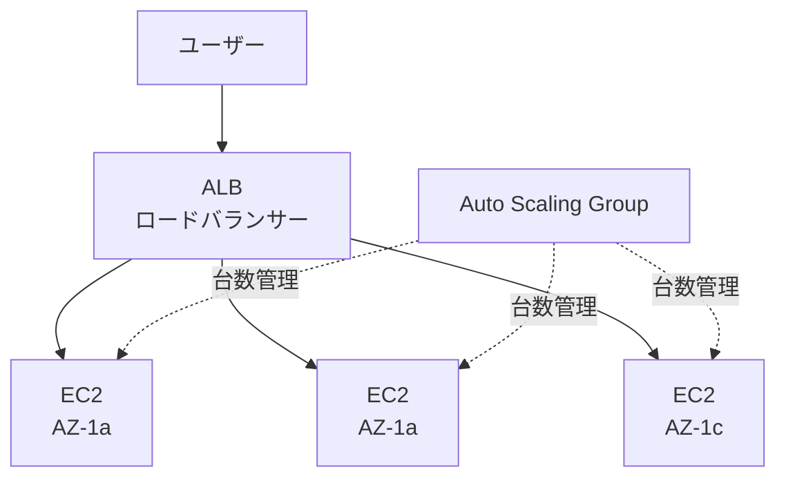

# 第3章: コンピューティングと関連サービス

> 所要時間の目安: 座学 30分 → ハンズオン 60分 → 練習問題 20分

---

## 座学

---

## Part 1: EC2の基本と購入オプション

**Amazon EC2（Elastic Compute Cloud）**は、クラウド上に仮想サーバーを提供するサービスです。物理サーバーを購入・管理することなく、数分でサーバーを起動・停止・変更できます。

EC2インスタンスには複数の**購入オプション**があり、ユースケースに応じて使い分けることでコストを最適化できます。

| 購入オプション | 特徴 | 向いているケース |
|---|---|---|
| **オンデマンド** | 使った分だけ支払い | 予測できない負荷・短期利用 |
| **リザーブドインスタンス** | 1〜3年契約で最大72%割引 | 安定した長期利用（本番環境） |
| **スポットインスタンス** | 未使用容量を最大90%割引 | 中断耐性のあるバッチ処理 |
| **Savings Plans** | 使用量をコミットして割引 | 柔軟な割引プラン |

**スポットインスタンス**は、AWSに余剰キャパシティがあるときだけ安価に使えるインスタンスです。AWSが容量を必要とするとき、2分前通知で中断されることがあります。そのため「処理の途中で止まっても問題ない（ステートレスな処理）」かつ「再開できる」ワークロードに向いています。バッチ処理・機械学習の学習・CI/CDのビルドなどが典型的な使い道です。

---

## Part 2: スケーリングと耐障害性

クラウドの設計で重要な思想は「**いかに単一障害点（SPOF）をなくすか**」です。1台のサーバーで全てを処理していると、そのサーバーが障害を起こした瞬間にサービス全体が停止します。

負荷への対応には2つのアプローチがあります。

- **スケールアップ（垂直スケーリング）**: サーバーのスペックを上げる（例: t3.medium → r5.xlarge）
- **スケールアウト（水平スケーリング）**: サーバーの台数を増やす

スケールアップには上限があり、1台のサーバーで動かし続ける限り単一障害点の問題は解消されません。クラウドでは**スケールアウト + マルチAZ**が基本設計です。

**ELB（Elastic Load Balancing）**は複数のEC2インスタンスに対してリクエストを分散するマネージドなロードバランサーです。代表的なタイプが**ALB（Application Load Balancer）**で、HTTP/HTTPSのレイヤー7レベルで動作し、URLパス・ホスト名・HTTPヘッダーに基づいたルーティングができます。

**Auto Scaling**はEC2インスタンスの台数を自動で増減させる機能です。スケーリングポリシーには以下の種類があります。

- **動的スケーリング**: CPU使用率など指標に応じてリアクティブに増減
- **スケジュールされたスケーリング**: 決まった時間に事前に台数を増やす（毎日17時に負荷が増えることがわかっている場合など）
- **予測スケーリング**: 過去のパターンから機械学習で予測して事前にスケール

**スケジュールされたスケーリング**は、動的スケーリングが「間に合わない」ケースに有効です。負荷が急増するタイミングが予測できるなら、事前に台数を増やしておくのが確実です。

---

## Part 3: コンテナとサーバーレス

**Amazon ECS（Elastic Container Service）**はDockerコンテナを管理・実行するオーケストレーションサービスです。ECSには2つの起動モードがあります。

- **EC2起動モード**: コンテナを実行するEC2インスタンス（クラスター）を自分で管理する。OSのパッチ適用・スケーリング設定が必要。
- **Fargate起動モード**: コンテナ実行基盤をAWSが完全に管理する。EC2インスタンスのプロビジョニングが不要。「**コンピュートリソースの管理を不要にしたい**」という要件が来たらFargateを選ぶ。

ECSの用語を整理しておきましょう。
- **クラスター**: コンテナが実行されるEC2インスタンス群（EC2モードの場合）
- **タスク**: 実際に動いているコンテナの実行単位
- **タスク定義**: タスクの設定（使うDockerイメージ、CPUとメモリ量、ポートなど）を定義したもの
- **サービス**: 一定数のタスクが常に起動していることを保証する仕組み

**AWS Lambda**は、サーバーを持たずにプログラムを実行できるサービスです。「イベント」をトリガーにしてコードが実行され、実行中だけ料金が発生します。常時稼働のサーバーが不要なため、非常にコスト効率が良いです。

Lambdaが他のAWSサービス（DynamoDB、S3など）にアクセスするには、**IAMロール（実行ロール）**が必要です。IAMユーザーやアクセスキーではなく、ロールを使うのがAWSのベストプラクティスです。

**EventBridge**はAWSのイベントバスで、スケジュール実行にも使えます。「LambdaをEventBridgeスケジュールでトリガーする」パターンは、定期バッチ処理（EC2・RDSの夜間停止など）に頻出の構成です。

---

## 練習問題

---

# 問題1
あなたはソリューションアーキテクトとしてAmazon DynamoDBテーブルにデータを書き込むためのAWS Lambda関数を作成しました。このLambda関数がDynamoDBテーブルを操作できるように権限を設定する必要があります。  
どのように権限を設定すればよいでしょうか。

## 選択肢
A. Lambda関数に適切な権限を付与したIAMユーザーを設定してDynamoDBへのアクセスを許可する。

B. Lambda関数に適切な権限を付与したIAMロールを設定してDynamoDBへのアクセスを許可する。

C. Lambda関数に適切な権限を付与したIAMポリシーを設定してDynamoDBへのアクセスを許可する。

D. Lambda関数に適切な権限を付与したリソースポリシーを設定してDynamoDBへのアクセスを許可する。

---

# 問題2
ある企業では、EC2インスタンス上でバッチ処理ワークロードを運用しています。このワークロードは複数のAmazon EC2インスタンスを活用しており、ステートレスな特性を持っています。そのため、インスタンス処理を途中で停止したり再開したりすることが容易です。全体の処理時間は約1時間を要します。あなたはソリューションアーキテクトとして、コストの最適化を求められています。  
コスト最適化を実現するために、ソリューションアーキテクトはどの購入オプションを選択すべきでしょうか。

## 選択肢
A. スポットインスタンスを利用する。

B. リザーブドインスタンスを利用する。

C. オンデマンドインスタンスを利用する。

D. ベアメタルインスタンスを利用する。

---

# 問題3
ある会社はAmazon EC2インスタンスにホストされているウェブサイトを運用しています。このウェブサイトのEC2インスタンスはHTTPトラフィックとHTTPSトラフィックを別々に処理するALBのターゲットグループに構成されています。この企業は、すべてのリクエストをこのウェブサイトに転送して、リクエストがHTTPSを使用するようにしたいと考えています。  
この要件を満たすために、ソリューションアーキテクトはどうすればよいでしょうか。

## 選択肢
A. HTTPSトラフィックだけを許可するようにALBのネットワークACLルールを設定する。

B. HTTPをHTTPSに変換するリスナールールをALBで設定する。

C. HTTPトラフィックをHTTPSトラフィックにリダイレクトするリスナールールをALBで設定する。

D. ALBをNLBに置き換えて、HTTPトラフィックをHTTPSトラフィックにリダイレクトするリスナールールを設定する。

---

# 問題4
あなたはソリューションアーキテクトとして、WebサーバーとデータベースサーバーからなるWebアプリケーションを設計しています。セキュリティ強化のため、データベースサーバーはWebサーバーからのトラフィックのみを受け入れる必要があります。また、このWebサーバーにはAuto Scalingグループを設定して、負荷に応じてインスタンス数を増減させます。  
この要件を満たすための適切なトラフィック設定方法はどれでしょうか。

## 選択肢
A. DBインスタンスのセキュリティグループのインバウンドルールにWEBサーバーインスタンスのプライベートIPアドレスを設定する。

B. DBインスタンスのセキュリティグループのインバウンドルールにWEBサーバーインスタンスのセキュリティグループIDを設定する。

C. DBインスタンスのセキュリティグループのインバウンドルールにWEBサーバーインスタンスのElastic IPアドレスを設定する。

D. DBインスタンスのセキュリティグループのインバウンドルールにWEBサーバーインスタンスのパブリックIPアドレスを設定する。

---

# 問題5
ある企業はEC2インスタンス上にアプリケーションを構築しました。Auto Scalingグループが設定されていますが、毎日17時から17時半の間にパフォーマンスが急激に低下しています。負荷増加が短時間のため、Auto Scalingによるインスタンスの追加が間に合っていないようです。  
ソリューションアーキテクトとして、どのようにこの問題を改善するべきでしょうか。

## 選択肢
A. Auto Scalingが起動するインスタンス数の最大数を増加する。

B. ELBによるロードバランシングを設定する。

C. Route53によるトラフィックルーティングを設定する。

D. Auto Scalingに対して、スケジュールされたスケーリングポリシーを追加する。

---

# 問題6
ある会社は複数のEC2インスタンスとRDS DBインスタンスを利用したアプリケーションを運用しています。業務時間外にEC2インスタンスとDBインスタンスを自動的に起動・停止してコストを削減することにしました。  
これらの要件を満たすソリューションはどれでしょうか。

## 選択肢
A. EC2インスタンスとDBインスタンスを起動・停止するcronジョブを設定する。このジョブをAmazon EventBridgeスケジュールに設定する。

B. EC2インスタンスとDBインスタンスを起動・停止するLambda関数を作成する。このLambda関数をAmazon EventBridgeスケジュールに設定する。

C. EC2インスタンスとDBインスタンスを起動・停止するStepFunctionsワークフローを作成する。このワークフローをAmazon EventBridgeスケジュールに設定する。

D. スケジュールドスケーリングを利用したAuto Scalingグループを使用して、EC2インスタンスのスケーリングを行う。業務時間外はDBインスタンスを０にスケールさせる。

---

# 問題7
ある企業がAWS上で3層アプリケーションを開発しています。このアプリケーションを複数のマイクロサービスに分割し、コンテナを利用します。また、AWS上でのコンテナ用コンピュートリソースの構成管理を不要にすることが求められています。  
この要件を満たすために、どのようなアプローチを取るべきでしょうか。

## 選択肢
A. Amazon ECSクラスターをEC2起動モードでプロビジョニングする。ECSクラスターのEC2ノードにAmazon EC2 Auto Scalingグループをアタッチし、コンテナにタスクを定義する。

B. AWS Lambda関数を作成して、マイクロサービスのコンポーネントを構成する。これらの関数をAmazon API Gatewayと統合して、スケーリングとトラフィック制御を実施する。

C. Amazon ECSクラスターをEC2起動モードでプロビジョニングする。コンテナにEC2タスクをデプロイする。

D. Amazon ECSクラスターをFargate起動モードでプロビジョニングする。コンテナにFargateタスクをデプロイする。

---

# 問題8
ある企業は、単一リージョン内の2つのAZに配置されたEC2インスタンスに対してALBおよびAuto Scalingが設定されたWebアプリケーションを運営しています。1つのAZがダウンし、かつAuto Scalingが残るAZで新たなインスタンスを起動できていない期間においても、アプリケーションが常に100%のピークロードを処理できるパフォーマンスを維持する必要があります。  
この要件を満たすために必要なアーキテクチャの構成はどれでしょうか。

## 選択肢
A. 3つのAZに対して、AZ毎に50%のピークロードを処理できるAuto Scaling設定を行ったEC2インスタンスを展開する。

B. 3つのAZに対して、AZ毎に30%のピークロードを処理できるAuto Scaling設定を行ったEC2インスタンスを展開する。

C. 2つのAZに対して、リージョン毎に50%のピークロードを処理できるAuto Scaling設定を行ったEC2インスタンスを展開する。

D. 2つのAZに対して、AZ毎に50%のピークロードを処理できるAuto Scaling設定を行ったEC2インスタンスを展開する。

---

# 問題9
ある企業がオンプレミス環境からAWSへの移行のため、KMSのカスタマー管理キーで暗号化されたAMIをコンサルティング会社のAWSアカウントと共有する必要があります。  
この要件を満たすために、ソリューションアーキテクトはどのような手順を踏むべきでしょうか。

## 選択肢
A. 暗号化されたAMIを公開して、コンサルティング会社のAWSアカウントがアクセスできるようにする。AWS KMSのキーポリシーを変更して、コンサルティング会社のAWSアカウントが暗号化に使用されたKMSキーを使用できるようにする。

B. AMIをコンサルティング会社のAWSアカウントのみと共有できるようにAMIのLaunchPermissionプロパティを変更する。AWS KMSのキーポリシーを変更して、コンサルティング会社のAWSアカウントが暗号化に使用されたKMSキーを使用できるようにする。

C. AMIをコンサルティング会社のAWSアカウントのみと共有できるようにAMIのLaunchPermissionプロパティを変更する。AWS KMSのキーポリシーを変更して、コンサルティング会社の所有する新しいKMSキーを許可して、このAMIに適用する。

D. 暗号化されたAMIを公開して、コンサルティング会社のAWSアカウントがアクセスできるようにする。AWS KMSのキーポリシーを変更して、コンサルティング会社の所有する新しいKMSキーを許可して、このAMIに適用する。

---

# 問題10
ある企業は、単一のEC2インスタンスにホストされたウェブアプリケーションを運用しています。同インスタンスはMySQLデータベースも同時に実行しています。アプリケーションをスケーラブルで高可用性なアーキテクチャに再構成して、MySQLの読み取りレイテンシーも削減することが求められています。  
これらの要件を満たすソリューションの組み合わせはどれでしょうか。（2つ選択）

## 選択肢
A. 複数のアベイラビリティーゾーンにEC2インスタンスを展開するようにALBとAuto Scalingグループを設定する。

B. 別リージョンに2つ目のEC2インスタンスを起動する。Route53のフェイルオーバールーティングポリシーを使用して、両方のリージョン内のEC2インスタンスにルーティングを構成する。

C. データベースをAmazon Aurora MySQLのグローバルデータベースに移行して、クロスリージョンリードレプリカを構成する。

D. データベースをAmazon Aurora MySQLクラスターに移行して、プライマリDBインスタンスとリーダーDBインスタンスを別々のアベイラビリティーゾーンに作成する。

E. データベースをAmazon Aurora MySQLのグローバルデータベースに移行して、マルチAZ配置を有効化する。

---

## 問題解説

---

# 問題1 解説

## 正解: B

## 解説
Lambda関数が他のAWSサービスにアクセスするには、**IAMロール（実行ロール）**をアタッチする必要があります。

- Lambda関数の実行ロールに、DynamoDBへの書き込み権限（`dynamodb:PutItem`など）を含むIAMポリシーをアタッチする
- Lambda関数が実行されると、このロールの権限を引き受けてDynamoDBにアクセスする
- **AWSサービス間のアクセスにはIAMロールを使用するのがベストプラクティス**

## 他の選択肢が不適切な理由
**A**: IAMユーザーはLambda関数に「設定する」仕組みがありません。Lambdaにはロールをアタッチします。

**C**: IAMポリシー単体でLambda関数にアタッチすることはできません。ポリシーはロールにアタッチして使用します。

**D**: リソースポリシーは「Lambda関数を誰が呼び出せるか」を制御するものであり、Lambda関数が外部サービスにアクセスするための権限とは異なります。

---

# 問題2 解説

## 正解: A

## 解説
**スポットインスタンス**は、AWSの未使用キャパシティを活用できる購入オプションで、オンデマンドと比べて最大90%のコスト削減が可能です。

このワークロードがスポットインスタンスに適している理由:
- ステートレスであり、中断されても再開が容易
- 処理時間が約1時間と短時間
- 複数インスタンスで分散処理しているため、一部が中断されても全体への影響が限定的

## 他の選択肢が不適切な理由
**B**: リザーブドインスタンスは1〜3年の長期契約。約1時間のバッチ処理には不要です。

**C**: オンデマンドはスポットと比較してコストが高く、中断耐性のあるワークロードでは最適ではありません。

**D**: ベアメタルインスタンスはハードウェアへの直接アクセスが必要なケース向けであり、コスト最適化が目的の場合に選ぶものではありません。

---

# 問題3 解説

## 正解: C

## 解説
ALBのHTTPリスナー（ポート80）に**リダイレクトアクション**を設定することで、HTTPでアクセスしたユーザーを自動的にHTTPS（ポート443）へ誘導できます。

設定方法:
- ALBのHTTP:80リスナーにリダイレクトアクションを設定
- リダイレクト先のプロトコルをHTTPS、ポートを443に指定
- ステータスコード301（永続的リダイレクト）でクライアントにHTTPS URLを返す

## 他の選択肢が不適切な理由
**A**: ネットワークACLでHTTPSのみを許可すると、HTTPでアクセスしたユーザーは接続が拒否されます。「すべてのリクエストをウェブサイトに転送」という要件を満たしません。

**B**: 「HTTPをHTTPSに変換する」という表現は不正確です。ALBが行うのはリダイレクト（HTTPステータス301/302で別URLへ転送）です。

**D**: ALBをNLBに変更する必要はありません。ALB単体でHTTP→HTTPSリダイレクトが可能です。

---

# 問題4 解説

## 正解: B

## 解説
セキュリティグループのインバウンドルールでは、ソースとして**別のセキュリティグループID**を指定できます。

Auto Scaling環境でこの方法が適切な理由:
- Auto Scalingでインスタンスが増減するため、個々のIPアドレスを指定する方法では管理が困難
- セキュリティグループIDを指定すれば、そのセキュリティグループに属するすべてのインスタンスからのトラフィックが自動的に許可される
- インスタンスが追加・削除されても、セキュリティグループの設定変更は不要

## 他の選択肢が不適切な理由
**A**: Auto ScalingでインスタンスのIPが増減するたびに手動更新が必要で、運用負荷が高いです。

**C**: Elastic IPはインスタンスごとに個別に割り当てが必要で、Auto Scalingで自動起動されるインスタンスへの適用が現実的ではありません。

**D**: パブリックIPはインスタンスの再起動で変わる可能性があります。DBへの通信にパブリックIPを使うのはセキュリティ上も不適切です。

---

# 問題5 解説

## 正解: D

## 解説
毎日17時〜17時半という**予測可能なパターン**の負荷増加には、**スケジュールされたスケーリング**が最適です。

- 事前に決められた時間（例: 16時50分）にインスタンス数を増やしておく
- 動的スケーリングでは間に合わない短時間の負荷増加に対応可能
- 負荷パターンが予測可能な場合に最も効果的

## 他の選択肢が不適切な理由
**A**: 最大数を増やしても、Auto Scalingがスケールアウトするタイミングは変わりません。「間に合わない」という問題は解消されません。

**B**: ELBは既存のインスタンス間で負荷を分散しますが、インスタンス数を増やす機能はありません。

**C**: Route 53はDNSサービスであり、短時間の負荷急増への即時対応には不適切です。

---

# 問題6 解説

## 正解: B

## 解説
**Lambda関数 + EventBridgeスケジュール**の組み合わせは、定期的なタスクの自動実行に最適なサーバーレスソリューションです。

- Lambda関数でEC2のstart/stop APIとRDSのstart/stop APIを呼び出す
- EventBridgeスケジュールで業務開始時刻と終了時刻にLambda関数をトリガー
- Lambda自体は実行時だけ課金されるためコストほぼゼロ

## 他の選択肢が不適切な理由
**A**: cronジョブを実行するには常時稼働するサーバーが必要で、コスト効率が悪くなります。

**C**: Step FunctionsはLambdaで十分な単純処理にはオーバーエンジニアリングです。

**D**: Auto Scalingのスケジュールドスケーリングはインスタンス数の増減に使えますが、RDS DBインスタンスの起動・停止には対応していません。

---

# 問題7 解説

## 正解: D

## 解説
要件は「コンテナを使用する」かつ「コンピュートリソースの構成管理を不要にする」の2つです。

**AWS Fargate**（ECSのFargate起動モード）の特徴:
- EC2インスタンスのプロビジョニング・パッチ適用・スケーリングの管理が不要
- コンテナの実行に必要なCPUとメモリを指定するだけで自動的にインフラが割り当てられる
- コンテナのためのサーバーレスコンピュートエンジン

## 他の選択肢が不適切な理由
**A / C**: EC2起動モードでは、EC2インスタンスの管理が必要です。「コンピュートリソースの管理を不要に」という要件を満たしません。

**B**: Lambdaはサーバーレスですが、常時稼働型のマイクロサービスとして運用するには実行時間制限（最大15分）やコールドスタートの課題があり、コンテナベースのECS/Fargateが適切です。

---

# 問題8 解説

## 正解: A

## 解説
「1つのAZがダウンしても、Auto Scalingが追いつく前の時点で100%のピークロードを処理できる」ことがポイントです。

計算:
- **3つのAZに各50%のキャパシティ** → 合計150%
- **1つのAZがダウン** → 残り2つで50% × 2 = **100%** ✓

## 他の選択肢が不適切な理由
**B**: 3つのAZ × 30% = 合計90%。1AZダウンで残り2つ = 60%。100%に届きません。

**C**: リージョン毎に50% = 合計50%。AZ障害後も50%以下の処理能力しかありません。

**D**: 2つのAZ × 50% = 合計100%。1AZダウンで残り1つ = 50%。100%に届きません。

---

# 問題9 解説

## 正解: B

## 解説
暗号化されたAMIを別のAWSアカウントと共有するには、以下の2つの設定が必要です。

1. **AMIのLaunchPermissionを変更**して、対象アカウントのみにアクセスを許可する
2. **KMSキーポリシーを変更**して、対象アカウントに暗号化キーの使用を許可する（`kms:DescribeKey`、`kms:ReEncrypt*`、`kms:CreateGrant`、`kms:Decrypt`）

## 他の選択肢が不適切な理由
**A / D**: 暗号化されたAMIは「公開（public）」に設定できないというAWSの制約があります。また、公開することはセキュリティのベストプラクティスに反します。

**C**: 既存のAMIに対して暗号化キーを後から変更することはできません。既存のKMSキーへのアクセス権限を対象アカウントに付与するのが正しいアプローチです。

---

# 問題10 解説

## 正解: A・D

## 解説
**A（ALB + Auto Scaling + マルチAZ）**
- 単一EC2インスタンスという単一障害点を解消
- ALBで複数EC2に負荷分散（スケーラビリティ）
- 複数AZに展開してAZ障害に対応（高可用性）

**D（Aurora MySQL + マルチAZリーダー）**
- プライマリDBとリーダーDBを別AZに配置（高可用性）
- リーダーDBが読み取りクエリを処理（読み取りレイテンシー削減）
- プライマリ障害時にリーダーが自動昇格

## 他の選択肢が不適切な理由
**B**: 別リージョンへのEC2追加はAuto Scalingによる自動スケーリングを含まず、「スケーラブル」の要件を十分に満たしません。

**C / E**: グローバルデータベースは複数リージョン間のレプリケーション用であり、単一リージョン内の要件には過剰です。

---

## ハンズオン

Box Drive: `03_コンピューティングと関連サービス/03_ハンズオン.md` を参照
