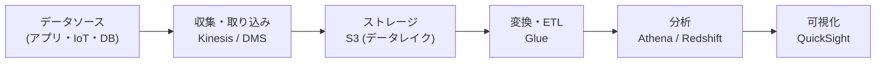

# 第8章: 分析・データ転送サービス

> 所要時間の目安: 座学 30分 → ハンズオン 60分 → 練習問題 20分

---

## 座学

---

## Part 1: ビッグデータの基本アーキテクチャ

AWSでは大量のデータを収集・変換・分析するためのサービスが揃っています。データの流れに沿ってサービスを整理します。

---

## Part 2: データ収集・ストリーミング

**Amazon Kinesis**はリアルタイムのストリーミングデータを収集・処理するサービス群です。

- **Kinesis Data Streams**: リアルタイムのデータストリームを収集し、複数のコンシューマーで処理できる。データは最大7日間保持。
- **Kinesis Data Firehose**: ストリームデータをS3・Redshift・OpenSearchなどに自動でデリバリーする。コンシューマーの実装が不要でシンプル。
- **Kinesis Data Analytics**: Kinesis Streamsのデータに対してSQLやApache Flinkでリアルタイム分析を実行する。

**AWS Database Migration Service（DMS）**は既存のDBをAWSへ移行するサービスです。Oracle・SQL Server・MySQLなどをRDS・Aurora・DynamoDBなどへ移行できます。移行中も元のDBを停止することなく稼働し続けながらデータを転送できます（継続的なレプリケーション）。

---

## Part 3: データ変換・分析・可視化

**AWS Glue**はサーバーレスのETL（Extract, Transform, Load）サービスです。S3・RDS・DynamoDBなどのデータを抽出し、変換してデータウェアハウスやデータレイクに格納します。

**AWS Glueデータカタログ**は、データの場所・スキーマ・変換ロジックを一元管理するメタデータリポジトリです。Athenaなどのサービスからデータカタログを参照してデータを検索できます。

**Amazon Athena**はS3に保存されたデータに対して直接SQLクエリを実行できるサーバーレスの分析サービスです。サーバーのプロビジョニングが不要で、クエリした分だけ課金されます。CSVやParquet・JSONなど多くのフォーマットをサポートします。

**Amazon Redshift**はペタバイト規模のデータウェアハウスサービスです。大量の構造化データに対するOLAP（オンライン分析処理）向けに最適化されています。Athenaが「S3データへのアドホッククエリ」に向いているのに対して、Redshiftは「高速な複雑分析クエリを繰り返し実行する」用途に向いています。

**Amazon QuickSight**はBIツール（ビジネスインテリジェンス）で、データを可視化してダッシュボードを作成できます。Athena・Redshift・RDS・S3などをデータソースとして接続できます。

---

## Part 4: データ転送

**AWS Snowball**は大容量データをAWSへ物理的に転送するサービスです。ネットワーク経由では時間がかかりすぎる大量データを、専用の物理デバイスを使って転送します。

- **Snowball Edge Storage Optimized**: 最大80TB。データ移行向け。
- **Snowball Edge Compute Optimized**: エッジコンピューティング用途もサポート。
- **AWS Snowmobile**: 100PBを超える極大規模データ転送用のトラック型デバイス。

ネットワーク転送 vs Snowball の選択は「データ量 ÷ ネットワーク帯域」で所要日数を計算して比較します。通常、数TB〜数十PBのデータ移行ではSnowballが有効です。

---

## 練習問題

Box Drive: `08_分析・データ転送サービス/08_練習問題.md` を参照

---

## 問題解説

Box Drive: `08_分析・データ転送サービス/08_問題解説.md` を参照

---

## ハンズオン

Box Drive: `08_分析・データ転送サービス/08_ハンズオン.md` を参照
