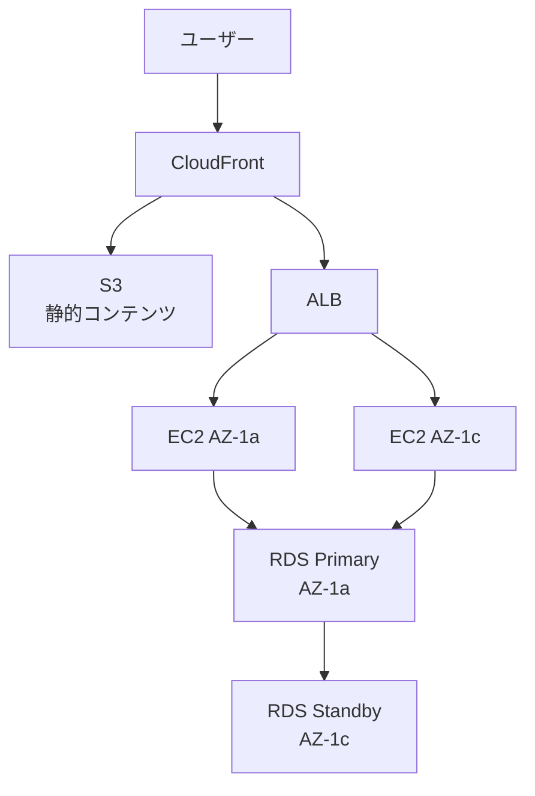
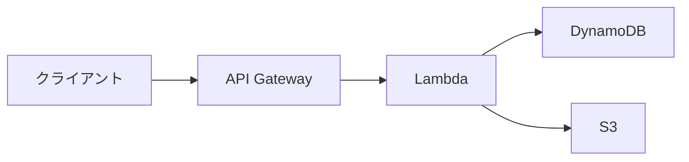
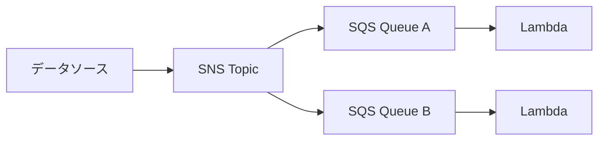

# 第10章: 総合演習

> 所要時間の目安: 演習 90〜120分

---

## 概要

第1〜9章の学習内容を組み合わせた総合的な設計演習です。実際のSAA-C03試験では、複数のサービスを組み合わせて最適なアーキテクチャを選択する問題が出題されます。

総合演習では以下の設計原則を意識して取り組みましょう。

### 設計の基本原則（Well-Architected Framework）

**信頼性**
- 単一障害点をなくす（マルチAZ・マルチインスタンス）
- 自動復旧（Auto Scaling・フェイルオーバー）
- バックアップとリカバリ

**セキュリティ**
- 最小権限の原則（IAMポリシー）
- 転送中・保管中のデータ暗号化（TLS・KMS）
- ネットワーク分離（パブリック/プライベートサブネット）

**パフォーマンス効率**
- スケールアウト（Auto Scaling・ELB）
- キャッシュ活用（CloudFront・ElastiCache・DAX）
- 適切なサービス選択（要件に合ったDB・ストレージ）

**コスト最適化**
- 適切な購入オプション（スポット・リザーブド・オンデマンド）
- 不要なリソースの削除
- ストレージクラスの最適化

**運用上の優秀性**
- Infrastructure as Code（CloudFormation）
- モニタリングとアラート（CloudWatch）
- 自動化（Lambda・EventBridge・Systems Manager）

---

## 頻出アーキテクチャパターン

### パターン1: スケーラブルなWebアプリケーション

### パターン2: サーバーレスAPI

### パターン3: イベント駆動処理

---

## ハンズオン

Box Drive: `10_総合演習/10_ハンズオン.md` を参照
