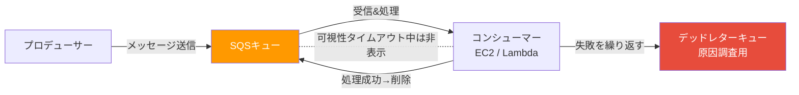
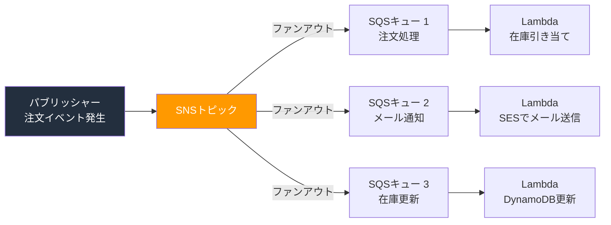

# 第7章: アプリケーションサービス

## 座学

## 今日の講義の概要

今回のテーマは**アプリケーションサービス**です。システム同士がデータをやり取りするための仕組みを学びます。

まず**クラウドサービスの3つのモデル**（IaaS / PaaS / SaaS）を整理した後、メッセージングサービスの**SQS**と**SNS**、メール配信の**SES**、そしてワークフロー管理の**SWF**と**Step Functions**を扱います。

特にSQSとSNSは、AWSのアーキテクチャ設計で頻繁に登場する重要なサービスです。試験にもよく出ますので、しっかり押さえていきましょう。

---

## クラウドサービスモデル（IaaS / PaaS / SaaS）

### 導入

では最初に、**クラウドサービスの3つのモデル**を整理しておきます。**IaaS（イアース）、PaaS（パース）、SaaS（サース）**です。

この3つは"**利用者がどこまで自分で管理するか**"で分かれています。

まず**IaaS（Infrastructure as a Service）**。サーバー、ネットワーク、ストレージなどの**インフラ基盤だけ**をクラウドで借りる形です。OS、ミドルウェア、アプリケーションはすべて自分で管理する。AWSでいうとEC2やVPCがこれにあたります。自由度は最も高いけど、運用負担も最も大きい。たとえるなら**土地と建物の骨組みだけ借りて、内装も家具も全部自分で用意する**イメージです。

次に**PaaS（Platform as a Service）**。インフラに加えて、OS・ミドルウェア・ランタイムなどの**アプリケーション実行環境まで**クラウドが提供してくれる。利用者はアプリケーションのコードとデータだけに集中できる。AWSでいうとElastic Beanstalk、RDS、Lambdaなどがこれにあたります。たとえるなら**内装済みのレンタルオフィス**。机も椅子もネット回線もあるので、自分の仕事道具を持ち込むだけで業務を始められる。

最後に**SaaS（Software as a Service）**。アプリケーションそのものをクラウドで提供する形です。利用者はブラウザやアプリから使うだけ。インフラもアプリも管理不要。GmailやSlack、AWS上だとAmazon WorkSpacesなどがこれにあたります。たとえるなら**ホテルに泊まる**。掃除もベッドメイキングも全部やってくれるので、利用者はただ使うだけ。

整理すると、IaaS → PaaS → SaaSの順に**AWS側の管理範囲が広がり**、利用者の運用負担は減っていきます。

今回出てくるサービスの多くはPaaSやSaaSの領域です。つまり、インフラの管理をAWSに任せて、私たちは"やりたいこと"に集中できる。この考え方を頭に入れておくと、各サービスの立ち位置がわかりやすくなります。

---

## SQS（Simple Queue Service）

### 導入（疎結合・メッセージキュー）

ここからアプリケーションサービスに入ります。まず**SQS**。

SQSの話に入る前に、そもそもシステム間でデータをやり取りする方法にはどんなものがあるか整理しましょう。大きく**4つ**あります。

1つ目は**API連携**。相手のシステムに直接リクエストを送って、レスポンスをもらう。REST APIやgRPCなどですね。リアルタイムにやり取りできるのがメリット。

2つ目は**データベース経由**。共有のデータベースにデータを書き込んで、別のシステムがそこから読み取る。シンプルだけど、データベースがボトルネックになりやすい。

3つ目は**ファイル経由**。CSVやJSONなどのファイルをS3のような共有ストレージに置いて、別のシステムが取りに行く。バッチ処理でよく使われます。

4つ目が**メッセージング**。これがSQSの領域です。システム間に**キュー（メッセージの一時保管場所）**を置いて、そこを経由してデータをやり取りする。

API連携は便利ですが、**相手のシステムが動いていないと通信できない**。メッセージングは、キューにメッセージを入れておけば**相手が後から取りに来ればいい**。この違いが重要です。

じゃあ、メッセージングがなぜ必要になるか。こんな場面を想像してください。ECサイトで注文が入ったら、在庫を減らして、決済して、確認メールを送る。この3つの処理が直接つながっていたらどうなりますか？

メール送信サーバーが落ちたら？ 注文全体が止まります。決済は成功したのにメールが送れなくて注文失敗……。お客さんは怒りますよね。

これが**密結合**の問題です。コンポーネント同士が直接つながっていると、1か所の障害が全体に波及する。

じゃあどうするか。間に**キュー（待ち行列）**を挟むんです。レストランの**注文伝票置き場**を想像してください。ウェイターがお客さんの注文を伝票に書いて置き場に入れる。料理人は順番に取って調理する。ウェイターと料理人が直接やり取りしないので、料理人が忙しくても注文が失われない。

これが**疎結合**の考え方で、AWSでこのキューを提供するのが**SQS**です。

### プロデューサーとコンシューマー

SQSの登場人物は3つ。さっきのレストランの例でそのまま対応します。

- **プロデューサー** = ウェイター。注文（メッセージ）をキューに入れる側
- **キュー** = 注文伝票置き場。メッセージを一時的に保管する場所
- **コンシューマー** = 料理人。キューからメッセージを取り出して処理する側

大事なのは、料理人（コンシューマー）は自分から伝票置き場を見に行きますよね。誰かが"新しい注文入ったよ！"と届けてくれるわけではない。これが**プル型**（ポーリング）です。コンシューマーが自分から"新しいメッセージありますか？"と取りに行く。この違い、後でSNSと比較するときに重要になります。

### エンドポイント

じゃあプロデューサーやコンシューマーは、キューにどうやってアクセスするのか。SQSのキューを作ると、**エンドポイント（URLアドレス）**が自動的に割り当てられます。

`https://sqs.ap-northeast-1.amazonaws.com/123456789012/my-queue`

こういう形式です。プロデューサーもコンシューマーも、このURLに対してAPIリクエストを送ることでメッセージの送受信を行います。レストランの例でいえば、伝票置き場の**住所**みたいなものですね。

### StandardキューとFIFOキュー

SQSには2種類のキューがあります。**Standardキュー**と**FIFOキュー**。

Standardキューは"スループット重視"。ほぼ無制限にメッセージを処理できます。ただし、メッセージの順番が入れ替わることがある。同じメッセージが2回届くこともある。

じゃあ、どんな場面なら順番が入れ替わっても大丈夫ですか？

**（間を取って受講生に考えさせる）**

たとえばサムネイル画像の生成。ユーザーがアップロードした100枚の写真のサムネイルを作る処理。どの写真から処理しても、最終的に100枚全部できあがればOKですよね。

一方、**FIFOキュー**は"順序保証"。先に入れたものが先に出る。しかも同じメッセージが重複しない。ただしスループットに上限がある。1秒あたり300メッセージ。

どんな場面で必要になりますか？ チャットアプリのメッセージです。「こんにちは」→「元気？」→「明日暇？」の順で送ったのに、相手に「明日暇？」→「こんにちは」→「元気？」と届いたら会話が成り立たない。同じメッセージが2回届くのも困る。順序保証と重複排除の両方が必要な場面です。

試験では、**順序保証・重複排除 → FIFO**、**大量メッセージの高速処理 → Standard** と覚えてください。

よく使われるパターンも紹介しておきます。

**Standardキューの代表的なパターン：**
- **画像・動画の変換処理**: ユーザーがアップロードした画像をキューに入れて、バックエンドのEC2やLambdaがリサイズや形式変換を行う。順番は関係なく、全部処理されればOK。
- **ログ・メトリクスの非同期収集**: アプリケーションのログやクリックストリームをキューに流して、後からまとめてS3やデータベースに保存する。
- **メール・通知の非同期送信**: ユーザー登録後の確認メールなど、即座に送れなくても数秒遅れれば十分な通知処理。
- **Auto Scalingとの連携**: キューに溜まったメッセージ数をCloudWatchで監視して、処理が追いつかなくなったらEC2インスタンスをスケールアウトする。これは試験でもよく出ます。

**FIFOキューの代表的なパターン：**
- **金融取引・決済処理**: 入金→出金の順序が逆転すると残高不整合が起きるため、厳密な順序保証が必要。
- **ECサイトの注文処理**: 在庫の引き当て→決済→出荷指示の順番が保証されないと、在庫がないのに決済が通るといった問題が起きる。
- **チャット・メッセージングアプリ**: メッセージの表示順が入れ替わるとユーザー体験が損なわれる。
- **ワークフローのステップ実行**: ステップ1の結果を使ってステップ2を実行するような、前後関係のある処理の連携。

共通しているのは、Standardは"**全部処理されればOK、速度優先**"、FIFOは"**順番と正確性が命**"ということです。

### 冪等性

Standardキューで同じメッセージが2回届く可能性がある、と言いました。ここで大事な概念が**冪等性（べきとうせい）**。

これは"同じ操作を何回やっても結果が同じ"という性質です。

たとえば"口座に1,000円入金する"という処理が2回届いたら？ 冪等性がないと2,000円入金されてしまう。冪等性を確保するには、メッセージIDを記録して"処理済みなら無視する"仕組みを入れる。

FIFOキューなら正確に1回の配信が保証されるので、この心配がない。ここもFIFOのメリットです。

### ポーリング（ロングポーリングとショートポーリング）

さっきコンシューマーはプル型と言いましたが、この"取りに行く方法"にも2種類あります。

**ロングポーリング**は、"メッセージありますか？ あるまで最大20秒待ちます"と聞く方式。待機中にメッセージが届けばすぐ返されるし、空のレスポンスが激減する。

**ショートポーリング**はデフォルトの動作で、"メッセージありますか？"と聞いて、なくても即座に"ないよ"と返ってくる。メッセージがなくても毎回API呼び出しが発生するので、コストがかさむ。

こう聞くとショートポーリングにメリットがないように思えますよね。じゃあなぜ2種類あるのか。

ショートポーリングのメリットは**即時性**です。キューに問い合わせたらすぐに結果が返ってくるので、"メッセージが来たら1秒でも早く処理を開始したい"ような超低レイテンシーが求められるケースでは有効です。たとえばリアルタイムゲームのイベント処理や、ユーザーの操作に即座に反応する必要があるインタラクティブなアプリケーションなどです。

一方、ロングポーリングは最大20秒待機するので、メッセージが届くまでに少しだけ遅延が発生する可能性がある。ただし大半のユースケースではこの遅延は問題にならないし、コスト削減のメリットの方がはるかに大きい。

使い分けをまとめると：
- **ほとんどのケース** → **ロングポーリング**（コスト削減、AWS公式も推奨）
- **超低レイテンシーが必要な特殊なケース** → **ショートポーリング**（即時応答）

試験で"SQSのコストを削減したい"と出たら、**ロングポーリングに変更**が答えです。

### 可視性タイムアウト・遅延キュー・デッドレターキュー

SQSにはもう3つ重要な機能があります。

1つ目、**可視性タイムアウト**。コンシューマーAがメッセージを受信して処理中に、コンシューマーBが同じメッセージを取ってしまったら二重処理になる。これを防ぐために、受信したメッセージを**設定した時間の間**、他のコンシューマーから"見えない"状態にする。

ここで注意してほしいのは、"処理している間"ではなく"**設定した時間の間**"ということです。タイムアウトが30秒なら、処理に10秒しかかからなくても30秒間見えない。逆に処理に60秒かかるのにタイムアウトが30秒だと、処理中にメッセージが再出現して別のコンシューマーが取ってしまう。だから**処理時間より長めに設定する**のがコツです。処理が終わったらメッセージを削除する。タイムアウト内に削除されなかったら、メッセージはキューに戻って別のコンシューマーが再処理できる。

2つ目、**遅延キュー**。メッセージをキューに入れてから一定時間経つまでコンシューマーに見せない。"注文後30分はキャンセル可能にしたい"みたいなケースで使います。これは**キュー全体**に対する設定です。特定のメッセージだけ遅延させたい場合は**メッセージタイマー**を使います。遅延キューがキュー単位、メッセージタイマーがメッセージ単位、と覚えてください。

3つ目、**デッドレターキュー（DLQ）**。何度処理しても失敗するメッセージ、ありますよね。それが通常のキューに居座り続けると詰まってしまう。DLQは**不着郵便物保管所**のようなもので、一定回数失敗したメッセージを退避させて、後から原因調査できるようにする。

試験では"処理に失敗したメッセージを調査したい"→**DLQ**です。



---

## SNS（Simple Notification Service）

### 導入（Pub/Sub・ファンアウト）

次は**SNS**。SQSとよく比較されるサービスです。

SQSは**1つのメッセージを1つのコンシューマーが処理する**方式でしたよね。複数のコンシューマーがいても、メッセージを取得できるのは1つだけ。可視性タイムアウトで他のコンシューマーからは見えなくなる仕組みでした。

SNSは"1対多"。**グループLINE**を想像してください。1つのメッセージを送ったら、グループ内の全員に同時に届きますよね。これが**Pub/Sub（パブリッシュ/サブスクライブ）**モデル、**ファンアウト**です。

SNSの登場人物もSQSと対比すると覚えやすいです。

- **トピック** = グループLINEのグループ。メッセージの配信先グループ
- **パブリッシャー** = メッセージを送る人。トピックにメッセージを発行する側。SQSでいうプロデューサー
- **サブスクライバー** = グループのメンバー。トピックを購読してメッセージを受け取る側。SQSでいうコンシューマー

**購読（サブスクリプション）**は、サブスクライバーがトピックに登録すること。1つのトピックに複数のサブスクリプションを設定できて、宛先もSQSキュー、Lambda関数、メール、HTTPSエンドポイントなど色々混在させられます。

SQSとの大きな違いは、SQSはコンシューマーが自分で取りに行く**プル型**でしたよね。SNSはトピックに発行した瞬間にサブスクライバーに届く**プッシュ型**です。

### SNS + SQSファンアウトパターン

特に試験で重要なのが**SNS + SQSファンアウトパターン**。

ECサイトで注文が入ったとき、"注文処理"と"通知メール"と"在庫更新"を同時にやりたい。SNSトピックに注文メッセージを発行すると、3つのSQSキューに同時に届く。各キューはそれぞれのコンシューマーが独立に処理する。

"1つのイベントを複数のシステムに同時配信したい"→ **SNS + SQSファンアウト**。これは鉄板パターンなので覚えてください。ハンズオン①でも実際に作ります。



### SNS FIFOトピック

SQSにStandardキューとFIFOキューがあったのを覚えていますか？ 実はSNSにも**スタンダードトピック**と**FIFOトピック**があります。

FIFOトピックは、メッセージの**厳密な順序保証**と**重複排除**を提供します。さっきのファンアウトパターンで"順序も守りたい"という場合、SNS FIFOトピック + SQS FIFOキューの組み合わせで実現できます。

FIFOトピックの名前もFIFOキューと同様、必ず `.fifo` で終わる必要があります（例: `order-topic.fifo`）。

試験では、"**ファンアウト構成で順序保証・重複排除が必要**"→ **SNS FIFOトピック + SQS FIFOキュー**。これをセットで覚えてください。

---

## SES（Simple Email Service）

**SES**は一言で言うと、AWSの**本格的なメール配信サービス**です。

"あれ、SNSでもメール送れるんじゃ？"と思いますよね。その通り、SNSでもメール通知はできます。でもSNSのメールは簡易的な通知用途。プレーンテキストで、装飾もできない。

SESはHTML形式のリッチなメール、添付ファイル、送信元ドメイン認証まで対応した**本格的なメール配信**。マーケティングメールや注文確認メールの大量送信はSES。アラート通知はSNS。この使い分けが試験で問われます。

---

## SWF（Simple Workflow Service）

ここからワークフローの話に入ります。

複数の処理を決まった順序で実行したい場面は多いですよね。"データを取得→加工→保存→通知"みたいな。これを管理するのがワークフローサービス。

まず**SWF**ですが、これは正直に言って**レガシーサービス**です。新規開発ではStep Functionsを使ってください。ただし試験には出ます。SWFを選ぶべき場面はたった1つ、**人間の承認ステップが必要な場合**。上司が画面で"承認"ボタンを押すまで次の処理に進まない、みたいなケース。それ以外は全部Step Functions。

---

## Step Functions

ここまでSQS、SNS、SESと個別のサービスを学んできましたが、実際の業務ではこれらを**組み合わせて**使うことが多いです。たとえばECサイトの注文処理なら、注文を受け付ける → 在庫を減らす → 決済する → SESで確認メールを送る、みたいな流れ。じゃあこの**処理の流れ全体をどう管理するか**？ ここで登場するのが**Step Functions**です。

Step Functionsは、複数のAWSサービスを組み合わせたワークフローを**ステートマシン（状態遷移図）**として定義するサービスです。

料理のレシピに例えるとわかりやすい。"材料を切る→炒める→味付けする→盛り付ける"。各ステップをLambda関数で実行させて、途中で"味見して薄かったら塩を足す"という分岐（**Choice**ステート）や、"焦がしたら作り直す"というエラー処理（**Catch**）も定義できる。

ビジュアルエディタで処理の流れをグラフィカルに確認できるのも大きなメリットです。

ステートの種類は6つ。**Task**（処理実行）、**Choice**（条件分岐）、**Parallel**（並列実行）、**Wait**（待機）、**Fail/Succeed**（失敗/成功）、**Map**（ループ処理）。全部覚える必要はないですが、Task・Choice・Catchは試験に出やすいです。

---

## 説明のコツまとめ

1. **「〇〇とは」で始めない**。「こんな問題がある → だからこのサービスが必要」の順番で話す
2. **受講生に問いかけてから説明する**。「どんな場面で順番が入れ替わっても大丈夫ですか？」と聞いて、2〜3秒の間を取る
3. **たとえ話を入れる**。注文伝票置き場、グループLINEなど。ただし、たとえ話の後に必ず技術的な説明に戻すこと
4. **似たサービスは対比で教える**。「SQSとSNSの違いは？」「SWFとStep Functionsの使い分けは？」 対比させると記憶に残りやすい
5. **試験のポイントは最後に添える**。説明の流れの中で自然に「試験ではここが問われます」と伝える。最初に言うと暗記感が出てしまう

---

## ハンズオン

### 第7回（4/4） ハンズオン手順書

> **所要時間の目安**: 講義内 約40〜50分（ハンズオン①: 15〜20分、ハンズオン②: 25〜30分）、ハンズオン③は宿題（20〜30分）

> **注意事項**
> - ハンズオン終了後は必ずリソースを削除してください（コスト発生防止）
> - 各手順の所要時間は目安です。チームで役割分担して進めてください
> - スクリーンショットを撮りながら進めると復習に役立ちます

---

#### 第7回（4/4）ハンズオン①：SNS + SQSファンアウト構成

##### このハンズオンで学ぶこと
- SNSトピックとSQSキューを組み合わせたファンアウトパターンの構築
- 1つのメッセージを複数のキューに同時配信する仕組みの体験
- メッセージングサービスを使った疎結合アーキテクチャの理解

##### リソース状況
- **新規作成**: inventory-queue、payment-queue、notification-queue（SQSキュー）、order-topic（SNSトピック）、サブスクリプション×3

##### ステップ1: SQSキューを3つ作成

座学で紹介した「ECサイトで注文が入ったら、在庫を減らして、決済して、確認メールを送る」という例を実際に作ります。3つの処理に対応するSQSキューを用意します。

1. コンソール上部の検索バーに「SQS」と入力 →「Simple Queue Service」を選択
2. 「キューを作成」をクリック
3. キュー1（在庫処理用）:
   - タイプ: `標準`
   - 名前: `inventory-queue`
   - 他はデフォルト →「キューを作成」
4. キュー2（決済処理用）:
   - タイプ: `標準`
   - 名前: `payment-queue`
   - 他はデフォルト →「キューを作成」
5. キュー3（メール通知用）:
   - タイプ: `標準`
   - 名前: `notification-queue`
   - 他はデフォルト →「キューを作成」

##### ステップ2: SNSトピックを作成

1. コンソール上部の検索バーに「SNS」と入力 →「Simple Notification Service」を選択
2. 左メニュー「トピック」→「トピックの作成」
3. タイプ: `スタンダード`
4. 名前: `order-topic`
5. 他はデフォルト →「トピックの作成」をクリック

##### ステップ3: SQSキューをSNSトピックにサブスクライブ

1. `order-topic` の画面 →「サブスクリプションの作成」
2. サブスクリプション1:
   - プロトコル: `Amazon SQS`
   - エンドポイント: `inventory-queue` のARN（SQSコンソールからコピー）
   - 「サブスクリプションの作成」をクリック
3. 左メニュー「トピック」→ `order-topic` を選択 →「サブスクリプションの作成」
4. サブスクリプション2:
   - プロトコル: `Amazon SQS`
   - エンドポイント: `payment-queue` のARN
   - 「サブスクリプションの作成」をクリック
5. 同様に左メニュー「トピック」→ `order-topic` →「サブスクリプションの作成」
6. サブスクリプション3:
   - プロトコル: `Amazon SQS`
   - エンドポイント: `notification-queue` のARN
   - 「サブスクリプションの作成」をクリック

##### ステップ4: メッセージを発行

> **補足**: ステップ3でサブスクリプションを作成した際に、SNSからSQSへの送信許可ポリシーが各キューに自動的に追加されています。手動でのアクセスポリシー設定は不要です。

1. SNSコンソール → `order-topic` →「メッセージの発行」
2. 件名: 空のまま
3. メッセージ構造: 「すべての配信プロトコルに同一のペイロード」のまま
4. メッセージ本文:
   ```
   {"orderId": "12345", "product": "Laptop", "amount": 1200}
   ```
5. メッセージ属性、メッセージグループID、有効期限（TTL）: 空のまま
6. 「メッセージの発行」をクリック

##### ステップ5: ファンアウト配信の確認

1. SQSコンソール → `inventory-queue` →「メッセージを送受信」
2. 「メッセージ受信」セクション内の「メッセージをポーリング」ボタンをクリック
3. **確認**: SNSから発行したメッセージが表示される
4. `payment-queue`、`notification-queue` でも同様に「メッセージを送受信」→「メッセージをポーリング」で確認 → 3つのキュー全てに同じメッセージが届いている（ファンアウト）

##### リソース削除

> **注意**: ハンズオン③（宿題）に取り組む場合は、ここではリソースを削除せずそのまま残してください。

1. SNSサブスクリプション3つを削除
2. SNSトピック `order-topic` を削除
3. SQSキュー `inventory-queue`、`payment-queue`、`notification-queue` を削除

---

#### 第7回（4/4）ハンズオン②：Step Functions ワークフロー構築

##### このハンズオンで学ぶこと
- Step Functionsのステートマシンを使ったワークフロー定義
- Lambda関数との連携（Taskステート）
- 条件分岐（Choiceステート）とエラー処理（Catch）の実装
- ビジュアルエディタでワークフローの動きを確認する体験

##### リソース状況
- **新規作成**: validate-order（Lambda関数）、process-order（Lambda関数）、OrderWorkflow（ステートマシン）、IAMロール（Step Functions用、Lambda用）

##### ステップ1: Lambda関数を2つ作成

1. コンソール上部の検索バーに「Lambda」と入力 →「Lambda」を選択
2. **関数1: validate-order**（注文のバリデーション）
   - 「関数の作成」→「一から作成」
   - 関数名: `validate-order`
   - ランタイム: `Python 3.14`
   - アーキテクチャ、デフォルトの実行ロール、その他の設定: デフォルトのまま
   - 「関数の作成」
   - コードソースに以下を貼り付けて「Deploy」:
     ```python
     import json

     def lambda_handler(event, context):
         order_amount = event.get("amount", 0)

         if order_amount <= 0:
             raise ValueError("Invalid order: amount must be positive")

         return {
             "statusCode": 200,
             "orderId": event.get("orderId", "unknown"),
             "amount": order_amount,
             "validated": True,
             "message": f"Order validated: amount = {order_amount}"
         }
     ```
   - **コードの説明**: 注文金額（amount）を取得し、0以下ならエラーを発生させる。正常ならバリデーション済みとして次のステップに渡す。

3. **関数2: process-order**（注文の処理）
   - 同様に「関数の作成」→「一から作成」
   - 関数名: `process-order`
   - ランタイム: `Python 3.14`
   - アーキテクチャ、デフォルトの実行ロール、その他の設定: デフォルトのまま
   - 「関数の作成」
   - コードソースに以下を貼り付けて「Deploy」:
     ```python
     import json

     def lambda_handler(event, context):
         order_id = event.get("orderId", "unknown")
         amount = event.get("amount", 0)

         if amount >= 10000:
             return {
                 "statusCode": 200,
                 "orderId": order_id,
                 "amount": amount,
                 "requiresApproval": True,
                 "message": f"High-value order {order_id}: requires manager approval"
             }
         else:
             return {
                 "statusCode": 200,
                 "orderId": order_id,
                 "amount": amount,
                 "requiresApproval": False,
                 "message": f"Order {order_id} processed successfully"
             }
     ```
   - **コードの説明**: 注文金額が10,000以上なら「上長承認が必要」（requiresApproval: True）、それ未満なら「処理完了」として返す。この分岐がStep FunctionsのChoiceステートで使われる。

##### ステップ2: Step Functionsステートマシンを作成

1. コンソール上部の検索バーに「Step Functions」と入力 →「Step Functions」を選択
2. 左メニュー「ステートマシン」→「ステートマシンの作成」をクリック
3. テンプレート: 「空白から作成」を選択
4. ステートマシン名: `OrderWorkflow`
5. タイプ: 「標準」のまま
6. 「続行」をクリック
6. 画面上部の「コード」タブを選択し、以下のASL（Amazon States Language）を貼り付ける:
   ```json
   {
     "Comment": "Order Processing Workflow",
     "StartAt": "ValidateOrder",
     "States": {
       "ValidateOrder": {
         "Type": "Task",
         "Resource": "<validate-orderのARN>",
         "Catch": [
           {
             "ErrorEquals": ["States.ALL"],
             "Next": "OrderFailed"
           }
         ],
         "Next": "ProcessOrder"
       },
       "ProcessOrder": {
         "Type": "Task",
         "Resource": "<process-orderのARN>",
         "Next": "CheckApproval"
       },
       "CheckApproval": {
         "Type": "Choice",
         "Choices": [
           {
             "Variable": "$.requiresApproval",
             "BooleanEquals": true,
             "Next": "RequiresApproval"
           }
         ],
         "Default": "OrderCompleted"
       },
       "RequiresApproval": {
         "Type": "Pass",
         "Result": "Order requires manager approval - workflow paused",
         "End": true
       },
       "OrderCompleted": {
         "Type": "Succeed"
       },
       "OrderFailed": {
         "Type": "Fail",
         "Error": "ValidationError",
         "Cause": "Order validation failed"
       }
     }
   }
   ```
   - `<validate-orderのARN>` と `<process-orderのARN>` はLambdaコンソールから各関数のARNをコピーして置き換える
8. 「作成」をクリック →「ロールの作成を確認」画面が表示されるので「確認」をクリック

##### ステップ3: ワークフローの内容を確認

保存すると、画面にワークフローの構成図が表示されます。このステートマシンの流れを確認しましょう。

1. **ValidateOrder**（Taskステート）: `validate-order` Lambda関数を呼び出し、注文金額が正しいかチェックする。金額が0以下ならエラーが発生し、**Catch**によって OrderFailed に遷移する。
2. **ProcessOrder**（Taskステート）: `process-order` Lambda関数を呼び出し、注文を処理する。金額が10,000以上かどうかの判定結果を返す。
3. **CheckApproval**（Choiceステート）: ProcessOrderの結果を見て**条件分岐**する。`requiresApproval` が true なら RequiresApproval へ、それ以外なら OrderCompleted へ進む。
4. **RequiresApproval**（Passステート）: 高額注文のため上長承認が必要であることを示して終了。
5. **OrderCompleted**（Succeedステート）: 注文処理が正常完了。
6. **OrderFailed**（Failステート）: バリデーションエラーで注文処理が失敗。

つまり、座学で学んだ**Task**（処理実行）、**Choice**（条件分岐）、**Catch**（エラー処理）が全て含まれたワークフローです。次のステップでは、異なる入力データを与えて、ワークフローがどう分岐するか実際に確認します。

##### ステップ4: 正常系のワークフローを実行

1. `OrderWorkflow` の画面 →「実行」ボタンをクリック →「実行の開始」画面が開く
2. 入力に以下を貼り付ける（通常の注文）:
   ```json
   {
     "orderId": "ORD-001",
     "product": "Laptop",
     "amount": 1200
   }
   ```
3. 「実行の開始」をクリック → ビジュアルエディタでワークフローの進行を確認
4. **確認**: ValidateOrder → ProcessOrder → CheckApproval → **OrderCompleted（緑）** の流れで成功

##### ステップ5: 高額注文のワークフローを実行（条件分岐）

1. `OrderWorkflow` の画面に戻り →「実行」ボタンをクリック →「実行の開始」画面が開く
2. 入力に以下を貼り付ける（高額注文）:
   ```json
   {
     "orderId": "ORD-002",
     "product": "Server",
     "amount": 50000
   }
   ```
3. 「実行の開始」をクリック
4. **確認**: ValidateOrder → ProcessOrder → CheckApproval → **RequiresApproval** に分岐（Choiceステートの動き）

##### ステップ6: エラー処理のワークフローを実行（Catch）

1. `OrderWorkflow` の画面に戻り →「実行」ボタンをクリック →「実行の開始」画面が開く
2. 入力に以下を貼り付ける（不正な注文）:
   ```json
   {
     "orderId": "ORD-003",
     "product": "Invalid",
     "amount": -100
   }
   ```
3. 「実行の開始」をクリック
4. **確認**: ValidateOrder → **OrderFailed（赤）** に遷移（Catchによるエラーハンドリング）

##### リソース削除

> **注意**: ハンズオン③（宿題）に取り組む場合は、ここではリソースを削除せずそのまま残してください。ハンズオン①のリソース（SNSトピック、SQSキュー）も残しておく必要があります。

1. Step Functionsステートマシン `OrderWorkflow` を削除
2. Lambda関数 `validate-order`、`process-order` を削除
3. IAMロール（Step Functions用、Lambda用）を削除

---

#### 第7回（4/4）ハンズオン③：SNS + SQS + Step Functions 統合構成（宿題）

> **宿題**: この課題はハンズオン①②で作成したリソースを活用して、イベント駆動アーキテクチャを構築する発展課題です。

##### このハンズオンで学ぶこと
- SQSキューをトリガーにしてLambda関数を自動実行する仕組みの体験
- Lambda関数からStep Functionsワークフローを起動する連携
- SNS → SQS → Lambda → Step Functions というイベント駆動アーキテクチャの構築

##### 全体の流れ

```
SNSトピック(order-topic)にメッセージを発行
  ↓ ファンアウト配信
  ├─ inventory-queue（在庫処理）
  ├─ payment-queue（決済処理）
  ├─ notification-queue（メール通知）
  └─ workflow-queue（ワークフロー起動用）★新規
       ↓ メッセージ到着をトリガー
     Lambda関数(start-workflow) ★新規
       ↓ ワークフロー起動
     Step Functions(OrderWorkflow) ※ハンズオン②で作成済み
```

##### 前提
- ハンズオン①のリソース（`order-topic`、SQSキュー3つ）が残っていること
- ハンズオン②のリソース（`OrderWorkflow`、Lambda関数2つ）が残っていること

##### ステップ1: ワークフロー起動用のSQSキューを作成

1. SQSコンソール →「キューを作成」
2. タイプ: `標準`
3. 名前: `workflow-queue`
4. 他はデフォルト →「キューを作成」

##### ステップ2: workflow-queueをSNSトピックにサブスクライブ

1. SNSコンソール → 左メニュー「トピック」→ `order-topic` を選択 →「サブスクリプションの作成」
2. プロトコル: `Amazon SQS`
3. エンドポイント: `workflow-queue` のARN
4. 「サブスクリプションの作成」をクリック

##### ステップ3: トリガー用Lambda関数を作成

1. Lambdaコンソール →「関数の作成」→「一から作成」
2. 関数名: `start-workflow`
3. ランタイム: `Python 3.14`
4. アーキテクチャ、デフォルトの実行ロール、その他の設定: デフォルトのまま
5. 「関数の作成」
6. コードソースに以下を貼り付けて「Deploy」:
   ```python
   import json
   import boto3

   sfn_client = boto3.client("stepfunctions")

   # ここにOrderWorkflowのARNを貼り付ける
   STATE_MACHINE_ARN = "<OrderWorkflowのARN>"

   def lambda_handler(event, context):
       for record in event["Records"]:
           body = json.loads(record["body"])
           # SNS経由の場合、メッセージ本文はさらにネストされている
           if "Message" in body:
               message = json.loads(body["Message"])
           else:
               message = body

           sfn_client.start_execution(
               stateMachineArn=STATE_MACHINE_ARN,
               input=json.dumps(message)
           )

       return {"statusCode": 200}
   ```
   - `<OrderWorkflowのARN>` はStep Functionsコンソールから `OrderWorkflow` のARNをコピーして置き換える
- **コードの説明**: SQSからメッセージを受け取り、SNS経由で届いたメッセージ本文を取り出して、Step Functionsのワークフローを起動する。

##### ステップ4: Lambda関数にIAMポリシーを追加

`start-workflow` 関数がSQSからメッセージを受信し、Step Functionsを起動できるように権限を追加します。

1. Lambdaコンソール → `start-workflow` →「設定」タブ →「アクセス権限」
2. 実行ロール名（`start-workflow-role-xxxxxxxx` のようなリンク）をクリック → IAMコンソールが開く
3. 「許可を追加」→「ポリシーをアタッチ」
4. 検索バーに `SQS` と入力 → `AmazonSQSFullAccess` にチェック
5. 検索バーに `StepFunctions` と入力 → `AWSStepFunctionsFullAccess` にもチェック
6. 「許可を追加」をクリック

##### ステップ5: SQSトリガーを設定

`workflow-queue` にメッセージが届いたら自動的に `start-workflow` 関数が実行されるようにします。

1. Lambdaコンソール → `start-workflow` →「設定」タブ →「トリガー」→「トリガーを追加」
2. ソース: `SQS`
3. SQSキュー: `workflow-queue` のARN
4. バッチサイズ: `1`
5. 他はデフォルト →「追加」

##### ステップ6: 統合テスト

1. SNSコンソール → `order-topic` →「メッセージの発行」
2. 件名: 空のまま
3. メッセージ構造: 「すべての配信プロトコルに同一のペイロード」のまま
4. メッセージ本文:
   ```
   {"orderId": "ORD-100", "product": "Laptop", "amount": 1200}
   ```
5. メッセージ属性、メッセージグループID、有効期限（TTL）: 空のまま
6. 「メッセージの発行」をクリック
7. Step Functionsコンソール → `OrderWorkflow` → 実行一覧に新しい実行が表示されていることを確認
8. **確認**: SNSにメッセージを発行しただけで、自動的にStep Functionsのワークフローが実行された（イベント駆動）

> **発展**: 金額を変えて（例: `"amount": 50000` や `"amount": -100`）再度メッセージを発行し、ワークフローの分岐やエラー処理が自動で動くことも確認してみましょう。

##### リソース削除（ハンズオン①②③の全リソース）

1. Lambda関数のSQSトリガーを削除
2. SNSサブスクリプション4つを削除
3. SNSトピック `order-topic` を削除
4. SQSキュー `inventory-queue`、`payment-queue`、`notification-queue`、`workflow-queue` を削除
5. Step Functionsステートマシン `OrderWorkflow` を削除
6. Lambda関数 `validate-order`、`process-order`、`start-workflow` を削除
7. IAMロール（Step Functions用、Lambda用×3）を削除

---

## 練習問題

### 問題1

あなたはソリューションアーキテクトとして、現在開発中のアプリケーションにAWSのメッセージングサービスを活用したメッセージ処理機能を追加する計画を立てています。最も重要な要件は、メッセージの順序が維持され、重複したメッセージが送信されないことです。

この要件を満たすために、最適なソリューションはどれでしょうか。（2つ選択）

<details>
<summary>選択肢を見る</summary>

A. Amazon SQSのFIFOキューを利用する。

B. Amazon SNSのFIFOトピックを利用する。

C. Amazon SESのFIFOトピックを利用する。

D. AWS Lambdaでメッセージを順序通りに処理する関数を設定する。

E. Amazon Step Functionsを利用して、メッセージを順序通りに処理するワークフローを設定する。

</details>

<details>
<summary>正解と解説を見る</summary>

### 正解
A、B

### 解説
Amazon SQSのFIFOキューは、先入れ先出し（FIFO）を厳密に保証し、正確に1回の配信（Exactly-Once Processing）で重複を排除するキュータイプです。

- メッセージの順序が厳密に保証される
- メッセージ重複排除IDにより、同じメッセージが2回以上配信されることがない
- スループットは1秒あたり最大300メッセージ（バッチ処理で最大3,000メッセージ）

Amazon SNSのFIFOトピックも同様に、厳密な順序保証と重複排除を提供する。SNS FIFOトピックとSQS FIFOキューを組み合わせたファンアウト構成でも順序が維持される。

### 他の選択肢が不適切な理由
C
Amazon SESはEメール送受信サービスであり、メッセージングサービスではありません。「FIFOトピック」という機能はSESには存在しません。

D
AWS Lambda関数はメッセージを処理する側のコンピューティングサービスであり、メッセージの順序を保証する機能は持っていません。順序保証はメッセージングサービス側（SQS FIFO、SNS FIFO）で実現します。

E
Amazon Step Functionsはワークフローオーケストレーションサービスであり、メッセージの順序保証や重複排除を行うメッセージングサービスではありません。

### まとめ
メッセージの順序保証と重複排除が必要な場合は、SQS FIFOキューまたはSNS FIFOトピックを使用する。Standardキューは順序を保証せず重複の可能性があるが、スループットがほぼ無制限。

</details>

---

### 問題2

ある企業は、AWS上でウェブアプリケーションを開発しています。このアプリケーションは複数のEC2インスタンスにホストされており、Amazon SQSキューからメッセージを取得して、EC2インスタンスがそのメッセージを処理し、処理結果をAmazon RDS DBインスタンスに書き込む仕組みです。処理完了後、メッセージはキューから削除されます。Amazon SQSキュー内のメッセージは重複しないものの、RDS DBインスタンスに保存されたデータには時折重複レコードが見受けられます。

重複メッセージの発生を防ぐために、ソリューションアーキテクトはどのような対策を講じるべきでしょうか。

<details>
<summary>選択肢を見る</summary>

A. ChangeMessageVisibility APIを使用して、適切な可視性タイムアウト値を設定する。

B. AddPermission APIを使用して、適切な権限を付与する。

C. CreateQueue APIを使用して、新しいキューを作成する。

D. ReceiveMessage APIを使用して、適切な待機時間を設定する。

</details>

<details>
<summary>正解と解説を見る</summary>

### 正解
A

### 解説
Amazon SQSの可視性タイムアウトは、コンシューマーがメッセージを受信した後、他のコンシューマーからそのメッセージが見えなくなる期間を制御する機能です。

- コンシューマーがメッセージを受信すると、そのメッセージは可視性タイムアウト期間中、他のコンシューマーからは見えなくなる
- タイムアウト期間内に処理が完了してメッセージが削除されれば、二重処理は発生しない
- タイムアウトが短すぎると、処理完了前にメッセージがキューに再出現し、別のコンシューマーが同じメッセージを取得してしまう
- ChangeMessageVisibility APIを使用して、処理にかかる時間より長い適切なタイムアウト値を設定することで解決できる

### 他の選択肢が不適切な理由
B
AddPermission APIはSQSキューのアクセス許可を付与するためのAPIであり、メッセージの重複処理の防止とは無関係です。

C
CreateQueue APIは新しいキューを作成するためのAPIです。新しいキューを作成しても、可視性タイムアウトの問題は解決しません。

D
ReceiveMessage APIの待機時間はロングポーリングの設定に関するものであり、コスト削減には有効ですが、メッセージの二重処理の防止には直接関係しません。

### まとめ
SQSキューで複数のコンシューマーが同じメッセージを重複処理してしまう場合は、可視性タイムアウトの値が短すぎることが原因。ChangeMessageVisibility APIで処理時間に応じた適切な値を設定する。

</details>

---

### 問題3

あなたはソリューションアーキテクトとして、EC2インスタンスにホストされたデータベースへの読込クエリを並列処理するソリューションを構築しています。多数のクエリ処理が発生することが見込まれるため、多数のEC2インスタンス群によって高速に処理できるようにする必要があります。あなたは一時的な負荷向上を懸念して、Auto Scalingを設定し、スポットインスタンスが一時的に割り当てられる構成を行いました。その際に特定のキューメッセージ処理が複数のインスタンスで重複利用されないようにする設定が必要です。

この要件を満たすための方法を選択してください。

<details>
<summary>選択肢を見る</summary>

A. Amazon SQSの標準キューを構成して、可視性タイムアウトを設定する。

B. Amazon SQSの標準キューを構成して、常設インスタンス用キューに優先処理されるプログラム処理を行う。

C. Amazon SQSの標準キューを構成して、メッセージをSQSに中継させてEC2インスタンスからのポーリング処理を構成する。

D. Amazon SQSの標準キューを構成して、キューメッセージ処理が複数のインスタンスで重複利用されないように個々のメッセージに対してOrderIDを設定する。

</details>

<details>
<summary>正解と解説を見る</summary>

### 正解
A

### 解説
Amazon SQSキューに可視性タイムアウトを設定することで、特定のインスタンスがキューメッセージを取得すると、他のインスタンスからは一定期間そのメッセージがキュー内から見えなくなります。

- 可視性タイムアウトを超過すると、他のインスタンスからもメッセージが再び見えるようになり、そのインスタンスによる処理が可能になる
- Auto Scalingでスポットインスタンスも含む構成では、インスタンスの入れ替わりが頻繁に起きるため、可視性タイムアウトによる重複防止が特に重要

### 他の選択肢が不適切な理由
B
常設インスタンス用キューを優先処理させるプログラム処理は独自実装が必要であり、SQSの機能で実現できる対応としては非効率です。

C
メッセージをSQSに中継させてポーリング処理を構成するだけでは、複数のインスタンスが同じメッセージを取得することを防げません。

D
SQSの標準キューには「OrderID」という機能はありません。FIFOキューにはメッセージ重複排除IDが存在しますが、標準キューで使用するものではありません。

### まとめ
SQS標準キューで複数のコンシューマーによるメッセージの重複処理を防ぐには、可視性タイムアウトを適切に設定する。処理にかかる時間より長めに設定することが重要。

</details>

---

### 問題4

ある企業は、Amazon EC2インスタンス上で業務アプリケーションを運用しています。このアプリケーションのデータレイヤーにはAmazon DynamoDBテーブルが使用されています。最近、このデータベースに対する書き込み処理の件数が増加したため、データ処理の遅延や失敗が頻発しています。あなたはソリューションアーキテクトとして、書き込み操作がどのような状況でも失われないようにするための対策を求められています。

この要件を満たすための最適なアプローチを選定してください。

<details>
<summary>選択肢を見る</summary>

A. DynamoDBにIOPSボリュームを利用する。さらにDynamoDBにはデッドレターキューを設定する。

B. DynamoDBの書込処理に対してAmazon SQSキューによる分散処理プロセスを設定する。さらにAmazon SQSにはデッドレターキューを設定する。

C. DynamoDBの書込処理に対してAmazon SQSキューとAWS Lambda関数による分散処理プロセスを設定する。さらにAmazon SQSキューにはデッドレターキューを設定する。

D. EC2インスタンスによってDynamoDBのデータ処理を実行する。さらにEC2インスタンスにはデッドレターキューを設定する。

</details>

<details>
<summary>正解と解説を見る</summary>

### 正解
C

### 解説
Lambda関数とAmazon SQSキューを連携することで、DynamoDBテーブルへの書き込み処理リクエストをAmazon SQSキューに保存して、データベース処理を実行することが可能です。

- SQSキューがバッファとして機能し、書き込みが一時的に失敗してもメッセージはキューに残る
- Lambda関数がSQSキューからメッセージを取得し、DynamoDBに書き込みを実行する
- SQSキューにデッドレターキュー（DLQ）を追加することで、maxReceiveCountを超えても処理できなかったメッセージがDLQに退避される
- DLQに退避されたメッセージは後から原因調査や再処理が可能

### 他の選択肢が不適切な理由
A
DynamoDBはマネージドサービスであり、IOPSボリュームという概念はありません。また、DynamoDBにデッドレターキューを直接追加することはできません。

B
Amazon SQSキューだけではDynamoDBテーブルへの書き込み処理を実行できません。SQSキューからメッセージを取得して処理するLambda関数が必要です。

D
EC2インスタンスにデッドレターキューを追加することはできません。デッドレターキューはSQSキューまたはLambda関数に設定するものです。

### まとめ
書き込み操作が失われないようにするには、SQS（バッファ）+ Lambda（処理実行）+ DLQ（失敗メッセージの退避）の3層構成が有効。DLQはSQSキューに追加する。

</details>

---

### 問題5

ある企業では、AWSを利用して発注管理アプリケーションの設計を行っています。このアプリケーションを通じてユーザーが発注を行うと、12時間以内にその処理が完了する必要があります。発注内容は多様であるため、注文を分類し、適切に管理することも求められています。

費用対効果と運用効率を最大限に高めながら、これらの要件を満たすための最適なソリューションはどれでしょうか。

<details>
<summary>選択肢を見る</summary>

A. 注文内容に応じた、複数のAmazon Kinesis Data Streamsシャードを作成する。適切なシャードにメッセージを送信するように、Amazon SNSトピックを作成する。データストリームに関連するSNSトピックにサブスクライブするようにアプリケーションを設定する。

B. 注文内容に応じた、複数のAWS Lambda関数とAmazon SNSトピックを作成する。Lambda関数を関連するSNSトピックにサブスクライブして、注文に応じたSNSトピックにメッセージを発行するように設定する。

C. Amazon SNSトピックを1つ作成して、このSNSトピックに複数のAmazon SQSキューをサブスクライブする。SNSトピックにフィルターを設定して注文内容に応じて適切なSQSキューに適切なメッセージを送信するようにメッセージをフィルタリングする。注文に応じたSQSキューからメッセージを受信するようにバックエンドサーバーを設定する。

D. 注文内容に応じた、複数のAmazon Kinesis Data Streamsのシャードを作成する。適切なシャードにメッセージを送信するように、ウェブアプリケーションを設定する。アプリケーションサーバーの各バックエンドグループを設定して、Kinesis Client Libraryを使用してそれぞれのデータストリームからのメッセージをプールする。

</details>

<details>
<summary>正解と解説を見る</summary>

### 正解
C

### 解説
注文内容に応じて処理を分類して振り分けるには、Amazon SNSとAmazon SQSを活用したファンアウト + メッセージフィルタリングが最適です。

- 1つのAmazon SNSトピックに、注文の種類に応じた複数のAmazon SQSキューをサブスクライブする
- SNSトピックにメッセージフィルタリングを設定し、メッセージ属性に基づいて適切なSQSキューにメッセージを振り分ける
- 各SQSキューの先にバックエンドサーバーを配置して、注文タイプに応じた処理を実行する
- トピックは1つで済み、新しい注文タイプが増えてもSQSキューとフィルターを追加するだけで対応可能

### 他の選択肢が不適切な理由
A
Kinesis Data Streamsはリアルタイムのストリーミングデータ処理用のサービスであり、注文メッセージの分類・振り分けに使うサービスとしては不適切です。

B
複数のSNSトピックとLambda関数を作る構成は動作しますが、注文の種類が増えるたびにSNSトピックとLambda関数のペアを追加する必要があり、運用が煩雑になります。

D
Kinesis Data Streamsとシャードを使った構成は、注文メッセージの振り分けには過剰で不適切です。

### まとめ
1つのイベントを分類して複数のシステムに振り分けたい場合は、SNS + SQSファンアウト + メッセージフィルタリングが最適。SNSのフィルターポリシーでメッセージ属性に基づいた振り分けが可能。

</details>

---

### 問題6

ある企業は、複数のEC2インスタンスにホストされたウェブアプリケーションを運用しています。このアプリケーションはAmazon SQSキューを利用してバックエンド処理を行っていますが、メッセージがない時間帯にもAPI呼び出しが頻繁に発生しており、SQSの利用コストが想定以上に高くなっています。

SQSの利用コストを最小限に抑えるために、ソリューションアーキテクトはどのような対策を講じるべきでしょうか。

<details>
<summary>選択肢を見る</summary>

A. SQSキューをFIFOキューに変更する。

B. SQSキューのReceiveMessageWaitTimeSecondsを20秒に設定して、ロングポーリングを有効化する。

C. SQSキューの遅延キュー設定を有効化して、DelaySecondsを最大値に設定する。

D. SQSキューのMaxNumberOfMessagesを10に設定して、一度に取得するメッセージ数を増やす。

</details>

<details>
<summary>正解と解説を見る</summary>

### 正解
B

### 解説
ロングポーリングは、コンシューマーがキューに問い合わせたとき、メッセージがなくても最大20秒間待機してからレスポンスを返す方式です。

- デフォルトのショートポーリングでは、メッセージがなくても即座にレスポンスが返るため、空のレスポンスに対してもAPI呼び出し料金が発生する
- ロングポーリングを有効化すると、待機中にメッセージが届けばすぐに返され、空のレスポンスが大幅に減少する
- ReceiveMessageWaitTimeSecondsを1〜20秒に設定することで有効化される
- ほとんどのユースケースでロングポーリングが推奨される

### 他の選択肢が不適切な理由
A
FIFOキューへの変更は順序保証や重複排除のためであり、コスト削減とは無関係です。むしろFIFOキューはスループットに上限があります。

C
遅延キューはメッセージの配信タイミングを遅らせる機能であり、空ポーリングによるコスト増加の解決にはなりません。

D
MaxNumberOfMessagesを増やすと一度に取得するメッセージ数は増えますが、メッセージがない時間帯の空ポーリング問題は解決しません。

### まとめ
SQSのコスト削減にはロングポーリングが最も効果的。ReceiveMessageWaitTimeSecondsを設定して空のレスポンスを減らすことで、API呼び出しコストを大幅に削減できる。

</details>

---

### 問題7

あるEコマース企業は、ユーザーが注文を完了した際にHTML形式の注文確認メールを自動送信する機能を実装する必要があります。このメールにはブランドロゴや注文明細のテーブルなどのリッチなデザインが含まれ、1日あたり数万通の送信が見込まれています。

この要件を満たすために、最も適切なAWSサービスはどれでしょうか。

<details>
<summary>選択肢を見る</summary>

A. Amazon SNSのEメール通知を利用して、注文確認メールを送信する。

B. Amazon Pinpointを利用して、注文確認メールを送信する。

C. Amazon SESを利用して、注文確認メールを送信する。

D. Amazon WorkMailを利用して、注文確認メールを送信する。

</details>

<details>
<summary>正解と解説を見る</summary>

### 正解
C

### 解説
Amazon SES（Simple Email Service）は、HTML形式のメール、添付ファイル、送信元ドメイン認証まで対応した本格的なメール配信サービスです。

- HTML形式のリッチなデザインメール（ブランドロゴ、テーブルなど）の送信に対応
- 大量メール送信に最適化されており、1日あたり数万〜数百万通の配信が可能
- トランザクションメール（注文確認、パスワードリセットなど）やマーケティングメールの両方に対応
- 送信元ドメイン認証（SPF、DKIM、DMARC）にも対応し、メール到達率を向上させる

### 他の選択肢が不適切な理由
A
Amazon SNSのEメール通知はプレーンテキストの簡易的な通知用途です。HTML形式のリッチなデザインメールは送信できません。SNSはシステムアラートなどの通知に適しています。

B
Amazon Pinpointはマーケティングキャンペーン向けのサービスであり、セグメント化されたユーザーへの一斉配信に向いています。トランザクションメール（注文確認など）にはSESが適切です。

D
Amazon WorkMailは企業向けのマネージドメールサービス（Gmailのようなもの）であり、アプリケーションからのプログラム的なメール送信には使用しません。

### まとめ
HTML形式のリッチなメールを大量送信する場合はSES。プレーンテキストのシステム通知はSNS。マーケティングキャンペーンはPinpoint。企業メールはWorkMail。

</details>

---

### 問題8

ある企業は、AWS上でデータ処理パイプラインを構築しています。このパイプラインでは、複数のAWS Lambda関数を順序通りに実行し、途中で処理結果に応じた条件分岐やエラー発生時のリトライ処理を含むワークフローを実現する必要があります。

この要件を満たすために、最も適切なAWSサービスはどれでしょうか。

<details>
<summary>選択肢を見る</summary>

A. AWS Step Functionsを利用して、ステートマシンとしてワークフローを定義する。

B. Amazon SWFを利用して、ワークフローを定義する。

C. Amazon EventBridgeを利用して、イベントルールでワークフローを構成する。

D. Amazon SQSを利用して、キューの連鎖でワークフローを構成する。

</details>

<details>
<summary>正解と解説を見る</summary>

### 正解
A

### 解説
AWS Step Functionsは、複数のAWSサービスを組み合わせたワークフローをステートマシン（状態遷移図）として定義・実行するサービスです。

- Taskステートで Lambda関数やAWSサービスを呼び出す処理を定義できる
- Choiceステートで処理結果に応じた条件分岐を実現できる
- Catchでエラー発生時のリトライやフォールバック処理を定義できる
- ビジュアルエディタでワークフローの流れをグラフィカルに確認できる
- サーバーレスで、インフラ管理が不要

### 他の選択肢が不適切な理由
B
Amazon SWFもワークフロー管理サービスですが、レガシーサービスであり、新規開発ではStep Functionsの使用が推奨されています。SWFを選ぶべき場面は、人間の承認ステップが必要な場合に限られます。

C
Amazon EventBridgeはイベントのルーティングサービスであり、複数ステップの順序制御や条件分岐を含むワークフロー管理機能は持っていません。

D
Amazon SQSはメッセージキューサービスであり、キューの連鎖でワークフロー的な処理は実現できますが、条件分岐やエラー処理の定義はできません。

### まとめ
複数のLambda関数を順序制御し、条件分岐やエラー処理を含む自動ワークフローにはStep Functions。人間の承認が必要な場合のみSWF。

</details>

---

### 問題9

ある企業は、社内の経費申請システムをAWS上で構築しています。このシステムでは、申請者がフォームに入力して経費申請を提出した後、上長が申請内容を確認して承認または却下するまで処理が進まない仕組みが必要です。承認後に自動的に経理部門への通知と会計システムへのデータ連携が実行されます。

この要件を満たすために、最も適切なAWSサービスはどれでしょうか。

<details>
<summary>選択肢を見る</summary>

A. AWS Step Functionsを利用して、Wait状態で承認を待つワークフローを構成する。

B. Amazon SWFを利用して、人間の承認ステップを含むワークフローを構成する。

C. Amazon EventBridgeを利用して、承認イベントをトリガーにワークフローを実行する。

D. Amazon SQSを利用して、承認待ちメッセージをキューに保持する。

</details>

<details>
<summary>正解と解説を見る</summary>

### 正解
B

### 解説
Amazon SWF（Simple Workflow Service）は、人間による承認ステップを含むワークフローをネイティブにサポートするサービスです。

- 人間のアクション（承認ボタンの押下など）を待つアクティビティタスクを定義できる
- 承認が完了するまでワークフローが自動的に待機し、承認後に次のステップに進む
- 承認後の自動処理（通知、データ連携など）もワークフロー内で定義できる

### 他の選択肢が不適切な理由
A
Step FunctionsのWait状態はタイマーベースの待機であり、「人間が操作するまで無期限に待つ」という要件にはネイティブに対応していません。人間の介入が必要なワークフローにはSWFが適しています。

C
Amazon EventBridgeはイベントのルーティングサービスであり、承認イベントを受け取ることは可能ですが、承認を待つワークフロー全体の管理には向いていません。

D
Amazon SQSはメッセージキューであり、承認待ちメッセージを保持できますが、ワークフロー全体の管理（承認後の通知やデータ連携の自動実行）はできません。

### まとめ
人間の承認ステップを含むワークフローにはSWF。自動処理のみのワークフローにはStep Functions。この使い分けが試験の重要ポイント。

</details>

---

### 問題10

あるソリューションアーキテクトは、Amazon SQSキューからメッセージを取得してデータ処理を行うEC2インスタンス群を構築しています。処理負荷はメッセージ量に応じて大きく変動するため、キューに溜まったメッセージ数に基づいてEC2インスタンスを自動的にスケーリングする必要があります。

この要件を満たすために、最も適切な構成はどれでしょうか。

<details>
<summary>選択肢を見る</summary>

A. CloudWatchでEC2インスタンスのCPU使用率を監視し、閾値を超えたらAuto Scalingでスケールアウトする。

B. Lambda関数でSQSキューのメッセージ数を定期的にチェックし、EC2インスタンスを起動・停止する。

C. ELBのリクエスト数をCloudWatchで監視し、閾値を超えたらAuto Scalingでスケールアウトする。

D. CloudWatchでSQSキューのApproximateNumberOfMessagesVisibleメトリクスを監視し、閾値を超えたらAuto Scalingでスケールアウトする。

</details>

<details>
<summary>正解と解説を見る</summary>

### 正解
D

### 解説
SQSキューのメッセージ数に基づいてEC2インスタンスを自動スケーリングするには、CloudWatchでSQSキューのApproximateNumberOfMessagesVisibleメトリクスを監視します。

- ApproximateNumberOfMessagesVisibleは、キューに溜まっている処理待ちメッセージの概数を示すメトリクス
- このメトリクスに基づいてCloudWatchアラームを設定し、閾値を超えたらAuto Scalingポリシーでスケールアウトする
- メッセージが減ったらスケールインする設定も可能
- SQSベースの処理では、CPU使用率やリクエスト数よりもキューのメッセージ数が処理負荷を直接反映する

### 他の選択肢が不適切な理由
A
CPU使用率はキュー処理の負荷を直接反映しません。キューにメッセージが溜まっていてもCPU使用率が低い場合や、逆にメッセージが少なくてもCPU使用率が高い場合があります。

B
Lambda関数でメッセージ数を定期的にチェックしてEC2インスタンスを起動・停止する構成は可能ですが、CloudWatch + Auto Scalingの組み合わせで実現すべきです。独自実装は運用負荷が高くなります。

C
ELBのリクエスト数はHTTPリクエストベースのスケーリングに適していますが、SQSキューからメッセージを取得する構成ではELBを経由しないため、キューのメッセージ数を見るのが正しいアプローチです。

### まとめ
SQSベースの処理でスケーリングする場合は、キューのApproximateNumberOfMessagesVisibleメトリクスをCloudWatchで監視してAuto Scalingを設定する。CPU使用率やELBリクエスト数ではなく、キューのメッセージ数が処理負荷を直接反映する指標。

</details>

---