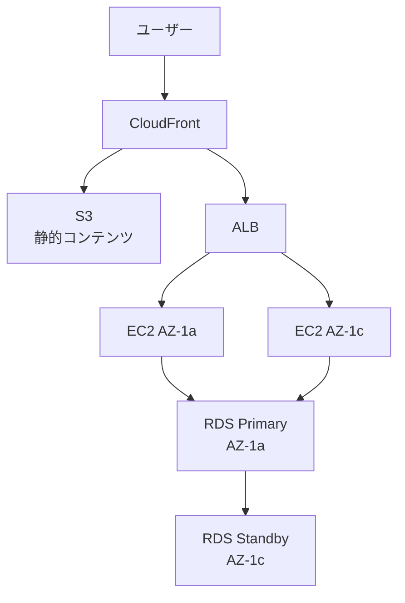
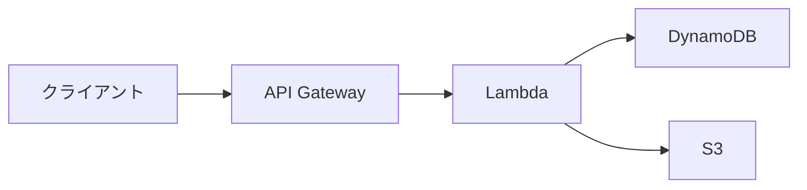
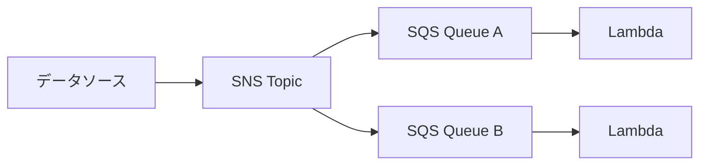
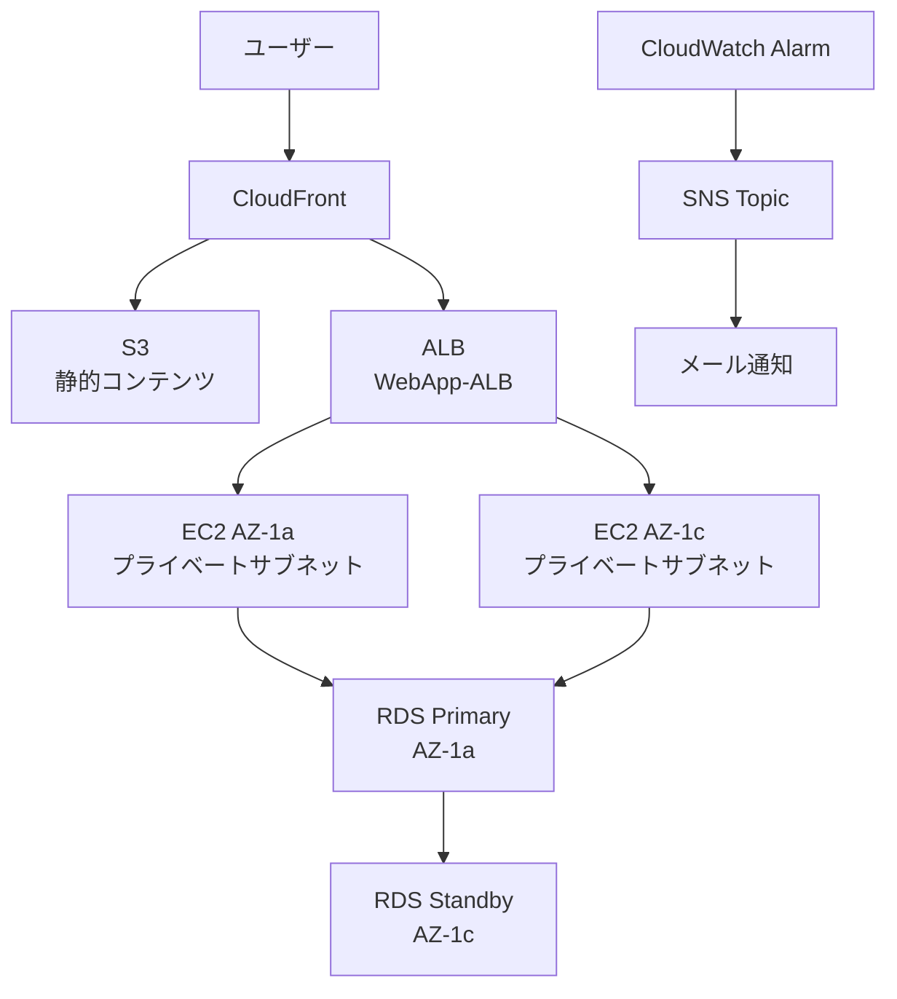

# 第10章: 総合演習

> 所要時間の目安: 演習 90〜120分

---

## 概要

第1〜9章の学習内容を組み合わせた総合的な設計演習です。実際のSAA-C03試験では、複数のサービスを組み合わせて最適なアーキテクチャを選択する問題が出題されます。

総合演習では以下の設計原則を意識して取り組みましょう。

### 設計の基本原則（Well-Architected Framework）

**信頼性**
- 単一障害点をなくす（マルチAZ・マルチインスタンス）
- 自動復旧（Auto Scaling・フェイルオーバー）
- バックアップとリカバリ

**セキュリティ**
- 最小権限の原則（IAMポリシー）
- 転送中・保管中のデータ暗号化（TLS・KMS）
- ネットワーク分離（パブリック/プライベートサブネット）

**パフォーマンス効率**
- スケールアウト（Auto Scaling・ELB）
- キャッシュ活用（CloudFront・ElastiCache・DAX）
- 適切なサービス選択（要件に合ったDB・ストレージ）

**コスト最適化**
- 適切な購入オプション（スポット・リザーブド・オンデマンド）
- 不要なリソースの削除
- ストレージクラスの最適化

**運用上の優秀性**
- Infrastructure as Code（CloudFormation）
- モニタリングとアラート（CloudWatch）
- 自動化（Lambda・EventBridge・Systems Manager）

---

## 頻出アーキテクチャパターン

### パターン1: スケーラブルなWebアプリケーション



### パターン2: サーバーレスAPI



### パターン3: イベント駆動処理



---

## ハンズオン

> **所要時間の目安**: 全体で約70〜90分

> **注意事項**
> - ハンズオン終了後は必ず**全リソースを削除**してください（コスト発生防止）
> - 削除順序を間違えると失敗するため、末尾の「リソース削除」セクションの手順を厳守
> - 各手順で詰まったら **Amazon Q** に質問しながら進める
> - スクリーンショットを撮りながら進めると後の振り返りに役立ちます

### 総合演習：本番想定Webシステムの一気通貫構築

これまで第1〜9章で学んだAWSサービスを組み合わせて、**実際の本番Webサービスに近いシステムを1つ構築する**シナリオです。ECサイトや業務システムでよく使われる典型構成 — **マルチAZのVPC + ALB + Auto Scaling + RDSマルチAZ + S3 + CloudFront + CloudWatch** — を実際に手を動かして組み上げます。

完成すると、グローバルに配信される静的コンテンツ（CloudFront + S3）と、Auto Scalingで耐障害性を備えた動的Webアプリ（ALB + ASG + RDS）が同居するシステムができあがります。

**このハンズオンで学ぶこと**
- 第1〜9章で学んだサービスを組み合わせた **実用的なWebシステムの一気通貫構築**
- マルチAZ構成によるWell-Architectedの **信頼性** の実装
- ALB + Auto Scaling Group（ASG）による弾力性とフォールトトレランスの体験
- RDS マルチAZによるデータベース冗長化
- CloudFront + S3による静的コンテンツのグローバル配信（**パフォーマンス効率**）
- セキュリティグループの階層設計（ALB → EC2 → RDS）による多層防御（**セキュリティ**）
- CloudWatchアラームによる運用監視の組み込み
- 全リソースの一括クリーンアップ（コスト管理）

**構成図**



> **重要**: 本ハンズオンは新規VPC（`WebApp-VPC`、CIDR `10.10.0.0/16`）に独立して構築します。第1〜9章で作成した既存リソース（`VPC-A` など）は使いません。

---

### ステップ1: VPCとサブネットを作成

> **第1章の復習**: VPC はAWS上に作る自分専用のプライベートネットワークです。サブネットを複数のAZに分散させることで、単一AZ障害への耐性を持たせます。

1. VPCコンソール →「VPCを作成」
2. 「VPCのみ」を選択
   - 名前: `WebApp-VPC`
   - IPv4 CIDR: `10.10.0.0/16`
   - 「VPCを作成」
3. 左メニュー「サブネット」→「サブネットを作成」→ VPCに `WebApp-VPC` を選択
4. 以下の **4つのサブネット** を順次作成:

| サブネット名 | アベイラビリティゾーン | IPv4 CIDR | 用途 |
|---|---|---|---|
| `WebApp-Public-1a` | ap-northeast-1a | `10.10.1.0/24` | パブリック（ALB） |
| `WebApp-Public-1c` | ap-northeast-1c | `10.10.2.0/24` | パブリック（ALB） |
| `WebApp-Private-1a` | ap-northeast-1a | `10.10.11.0/24` | プライベート（EC2/RDS） |
| `WebApp-Private-1c` | ap-northeast-1c | `10.10.12.0/24` | プライベート（EC2/RDS） |

5. 各パブリックサブネットを選択 →「アクション」→「サブネット設定を編集」→「**パブリックIPv4アドレスの自動割り当てを有効化**」にチェック →「保存」（`WebApp-Public-1a` と `WebApp-Public-1c` の両方で実施）

---

### ステップ2: インターネットゲートウェイとルートテーブルを設定

> **第1章の復習**: IGW はVPCとインターネットをつなぐ出入り口です。ルートテーブルで `0.0.0.0/0 → IGW` のルートをパブリックサブネットに関連付けることで、そのサブネット内のリソースがインターネットと通信できるようになります。

1. 左メニュー「インターネットゲートウェイ」→「作成」
   - 名前: `WebApp-IGW` →「作成」
2. 作成後 →「アクション」→「VPCにアタッチ」→ `WebApp-VPC` を選択 →「アタッチ」
3. 左メニュー「ルートテーブル」→「作成」
   - 名前: `WebApp-RT-Public`、VPC: `WebApp-VPC` →「作成」
4. `WebApp-RT-Public` を選択 →「ルート」タブ →「ルートを編集」→「ルートを追加」
   - 送信先: `0.0.0.0/0`、ターゲット: `WebApp-IGW`
   - 「変更を保存」
5. 「サブネットの関連付け」タブ → `WebApp-Public-1a` と `WebApp-Public-1c` の両方にチェック →「保存」

> プライベートサブネット用のルートテーブルはVPC作成時のメインルートテーブル（IGWルートなし）をそのまま使用します。

---

### ステップ3: NATゲートウェイを作成

> **第1章の復習**: プライベートサブネットのEC2はインターネットに直接出られません。NATゲートウェイをパブリックサブネットに置くことで、EC2からの**アウトバウンド通信だけ**を許可しつつ、外部からの直接アクセスは遮断できます。

1. VPCコンソール → 左メニュー「NATゲートウェイ」→「作成」
   - 名前: `WebApp-NAT`、サブネット: `WebApp-Public-1a`
   - 接続タイプ: `パブリック`、Elastic IP割り当て: 「Elastic IPを割り当て」
   - 「NATゲートウェイを作成」
2. ステータスが `Available` になるまで待つ（1〜2分）
3. 左メニュー「ルートテーブル」→ `WebApp-VPC` のメインルートテーブル（`WebApp-RT-Public` **以外**）を選択
4. 「ルート」タブ →「ルートを追加」
   - 送信先: `0.0.0.0/0`、ターゲット: `WebApp-NAT`
   - 「変更を保存」

---

### ステップ4: セキュリティグループを3層で作成

> **第1・2章の復習**: セキュリティグループはリソースに付ける仮想ファイアウォールです。ソースに**別のセキュリティグループIDを指定**することで、「ALBからのトラフィックだけEC2に通す」という最小権限の多層防御が実現できます。

階層: **ALB（外部公開）→ EC2（ALBからのみ受信）→ RDS（EC2からのみ受信）**

1. VPCコンソール 左メニュー「セキュリティグループ」→「作成」
2. **`WebApp-SG-ALB`**（ALB用）
   - 名前: `WebApp-SG-ALB`、VPC: `WebApp-VPC`
   - インバウンド: タイプ `HTTP`、ソース `0.0.0.0/0`
3. **`WebApp-SG-EC2`**（EC2用）
   - 名前: `WebApp-SG-EC2`、VPC: `WebApp-VPC`
   - インバウンド: タイプ `HTTP`、ソース `WebApp-SG-ALB`（セキュリティグループID指定）
4. **`WebApp-SG-RDS`**（RDS用）
   - 名前: `WebApp-SG-RDS`、VPC: `WebApp-VPC`
   - インバウンド: タイプ `MYSQL/Aurora`（ポート3306）、ソース `WebApp-SG-EC2`

> **W-A視点（セキュリティの柱）**: ソースにCIDRではなく**セキュリティグループID**を指定することで、IPアドレスの変動に強い多層防御が実現できます。

---

### ステップ5: RDSサブネットグループとRDSマルチAZインスタンスを起動

> **第5章の復習**: RDS マルチAZでは、プライマリとスタンバイが別AZに配置され、同期レプリケーションで常に同じデータを保持します。プライマリに障害が起きると自動フェイルオーバーしてスタンバイが昇格します。

> **重要**: RDSは起動完了まで5〜10分かかります。**起動命令を出したら、待っている間に次のステップに進んで**並行作業しましょう。

1. RDSコンソール → 左メニュー「サブネットグループ」→「DB サブネットグループを作成」
   - 名前: `WebApp-RDS-SubnetGroup`、VPC: `WebApp-VPC`
   - AZ: `ap-northeast-1a`、`ap-northeast-1c`
   - サブネット: `WebApp-Private-1a`（10.10.11.0/24）、`WebApp-Private-1c`（10.10.12.0/24）
2. 左メニュー「データベース」→「データベースの作成」
   - エンジン: `MySQL`
   - テンプレート: `開発/テスト`（無料利用枠はマルチAZが使えないため）
   - **可用性と耐久性**: `マルチAZ DBインスタンス`
   - DBインスタンス識別子: `webapp-rds`
   - マスターユーザー名: `admin`、パスワード: 任意（メモしておく）
   - DBインスタンスクラス: `db.t3.micro`、ストレージ: 汎用SSD `20 GiB`
   - 接続: VPC `WebApp-VPC`、DBサブネットグループ `WebApp-RDS-SubnetGroup`、パブリックアクセス `なし`、セキュリティグループ `WebApp-SG-RDS`
   - 追加設定 → 最初のデータベース名: `webappdb`
3. 「データベースの作成」→ ステータス `作成中` のまま **次のステップへ進む**

---

### ステップ6: EC2起動テンプレートを作成

> **第3章の復習**: 起動テンプレートはEC2の設定（AMI・インスタンスタイプ・SG・ユーザーデータ）を定義したひな形です。Auto Scaling Groupと組み合わせることで、同じ設定のEC2を自動的に何台でも起動できます。

1. EC2コンソール → 左メニュー「起動テンプレート」→「作成」
   - 名前: `WebApp-LaunchTemplate`
   - AMI: `Amazon Linux 2023`
   - インスタンスタイプ: `t2.micro`
   - キーペア: `キーペアなしで続行`（Session Managerでアクセスする想定）
   - ネットワーク設定: VPC `WebApp-VPC`、セキュリティグループ `WebApp-SG-EC2`
   - 高度な詳細 → IAMインスタンスプロファイル: `EC2-SSM-Role`（第9章で作成したSSM用ロール）
   - **ユーザーデータ** に以下を貼り付け:

```bash
#!/bin/bash
dnf update -y
dnf install -y httpd mariadb105
systemctl enable --now httpd
TOKEN=$(curl -s -X PUT "http://169.254.169.254/latest/api/token" -H "X-aws-ec2-metadata-token-ttl-seconds: 21600")
INSTANCE_ID=$(curl -s -H "X-aws-ec2-metadata-token: $TOKEN" http://169.254.169.254/latest/meta-data/instance-id)
AZ=$(curl -s -H "X-aws-ec2-metadata-token: $TOKEN" http://169.254.169.254/latest/meta-data/placement/availability-zone)
cat <<EOF > /var/www/html/index.html
<html>
<head><title>WebApp</title></head>
<body style="font-family:sans-serif;text-align:center;padding:50px;">
  <h1>第10章 総合演習 WebApp</h1>
  <p>Instance ID: <b>$INSTANCE_ID</b></p>
  <p>AZ: <b>$AZ</b></p>
</body>
</html>
EOF
```

2. 「起動テンプレートを作成」

---

### ステップ7: ターゲットグループとALBを作成

> **第3章の復習**: ALBはHTTP/HTTPSトラフィックを複数のEC2に振り分けるロードバランサーです。ターゲットグループが転送先EC2の登録・ヘルスチェックを管理し、ALBはリスナーのルールに基づいてトラフィックを転送します。

1. EC2コンソール → 左メニュー「ターゲットグループ」→「作成」
   - ターゲットタイプ: `インスタンス`、名前: `WebApp-TG`
   - プロトコル/ポート: `HTTP` / `80`、VPC: `WebApp-VPC`
   - ヘルスチェックパス: `/`
   - 「次へ」→ ターゲットは未登録のまま「ターゲットグループの作成」
2. 左メニュー「ロードバランサー」→「作成」→「Application Load Balancer」
   - 名前: `WebApp-ALB`、スキーム: `インターネット向け`、VPC: `WebApp-VPC`
   - マッピング: `ap-northeast-1a` → `WebApp-Public-1a`、`ap-northeast-1c` → `WebApp-Public-1c`
   - セキュリティグループ: `WebApp-SG-ALB`
   - リスナー: `HTTP:80` → 転送先 `WebApp-TG`
   - 「ロードバランサーの作成」
3. 作成後、**ALBのDNS名**（`WebApp-ALB-xxxxx.ap-northeast-1.elb.amazonaws.com`）をメモ

---

### ステップ8: Auto Scaling Groupを作成

> **第3章の復習**: Auto Scaling Group（ASG）はEC2インスタンスの台数を自動で増減させる仕組みです。複数AZに分散配置することで、負荷増加への自動対応と障害時の自己修復を同時に実現します。

1. EC2コンソール → 左メニュー「Auto Scaling グループ」→「作成」
   - 名前: `WebApp-ASG`、起動テンプレート: `WebApp-LaunchTemplate`
2. ネットワーク: VPC `WebApp-VPC`、サブネット: `WebApp-Private-1a`、`WebApp-Private-1c` の両方
3. 「既存のロードバランサーにアタッチ」→ ターゲットグループから `WebApp-TG` を選択
4. グループサイズ:
   - 希望する容量: `2`、最小: `2`、最大: `4`
5. 「Auto Scaling グループを作成」

> **W-A視点（信頼性の柱）**: 希望容量2台を **2つのAZに分散**させることで、片方のAZが障害でも残りのAZでサービス継続できます。

---

### ステップ9: S3バケット + 静的サイトホスティングを設定

> **第4章の復習**: S3はオブジェクトストレージです。静的ウェブサイトホスティング機能を有効にすると、バケット内のHTMLファイルをWebサーバーなしで配信できます。

1. S3コンソール →「バケットを作成」
   - バケット名: `webapp-static-<チーム名>`（グローバルで一意な名前）
   - リージョン: `ap-northeast-1`
   - ブロックパブリックアクセス: いったんすべてオフ
2. バケットに以下の `index.html` をアップロード:

```html
<html>
<head><title>Static Page</title></head>
<body style="font-family:sans-serif;text-align:center;padding:50px;background:#f0f0f0;">
  <h1>第10章 総合演習 静的コンテンツ</h1>
  <p>これは S3 + CloudFront で配信される静的ページです</p>
</body>
</html>
```

3. バケットの「プロパティ」タブ →「静的ウェブサイトホスティング」→「編集」
   - ホスティング: `有効`、インデックスドキュメント: `index.html` →「保存」

---

### ステップ10: CloudFrontディストリビューションを作成

> **第6章の復習**: CloudFrontは世界中のエッジロケーションにコンテンツをキャッシュして低遅延配信するCDNです。OAC（Origin Access Control）を使うことで、S3への直接アクセスを禁止しCloudFront経由のみに限定できます。

> **重要**: CloudFrontはデプロイ完了まで15〜20分かかります。作成したら次のステップ（CloudWatchアラーム設定）を並行して進めましょう。

1. CloudFrontコンソール →「ディストリビューションを作成」
2. オリジン: 上で作成したS3バケットを選択
   - **S3バケットアクセス**: `Origin Access Control 設定 (推奨)` を選択
   - OAC: 「コントロール設定を作成」→ デフォルトのまま「作成」
3. デフォルトのキャッシュビヘイビア → ビューワープロトコルポリシー: `Redirect HTTP to HTTPS`
4. 設定: デフォルトルートオブジェクト: `index.html`
5. 「ディストリビューションを作成」
6. 作成後、画面上部の案内に従ってバケットポリシーをS3バケットの「アクセス許可」→「バケットポリシー」に貼り付け
7. **CloudFrontのドメイン名**（`dxxxxxxx.cloudfront.net`）をメモ

---

### ステップ11: CloudWatchアラームを設定

> **第9章の復習**: CloudWatch AlarmはMetricsの値が閾値を超えたときにアクションを発動します。SNSトピックと組み合わせることで、CPU急騰などの異常をリアルタイムにメール通知できます。

1. CloudWatchコンソール →「アラーム」→「アラームの作成」
2. メトリクスの選択: 「EC2」→「Auto Scaling グループ別メトリクス」→ `WebApp-ASG` の `CPUUtilization`
3. 条件: しきい値 `70` 以上、期間 `1分`
4. アクション:「通知」→「新しいトピックの作成」
   - トピック名: `cpu-alert-final`、Eメール: 受信できるアドレスを入力
5. アラーム名: `WebApp-CPU-Alarm` →「作成」
6. 届いたメールの確認リンクをクリックしてサブスクリプション承認

---

### ステップ12: 動作確認

#### ① ALB経由で動的Webアプリにアクセス
1. ブラウザで **ALBのDNS名** にアクセス（`http://WebApp-ALB-xxxxx...`）
2. `第10章 総合演習 WebApp` ページが表示され、Instance IDとAZが見えることを確認
3. ブラウザを何度かリロード → **異なるInstance IDが交互に表示される** ことを確認（ALBによる負荷分散）

#### ② CloudFront経由で静的サイトにアクセス
1. ブラウザで **CloudFrontのドメイン名** にアクセス（`https://dxxxxxxx.cloudfront.net/`）
2. `第10章 総合演習 静的コンテンツ` ページが表示されることを確認
3. S3に直接アクセスしようとすると拒否される（OACで正しく保護されている）ことも確認

#### ③ EC2からRDSへ接続テスト（Session Manager）
1. Systems Manager → Session Manager → ASGで起動したEC2インスタンスを選択 →「セッションを開始する」
2. 以下のコマンドでRDSに接続:
   ```bash
   mysql -h <RDSエンドポイント> -u admin -p
   ```
3. 接続できたら以下を実行:
   ```sql
   SHOW DATABASES;
   USE webappdb;
   CREATE TABLE messages (id INT, msg VARCHAR(100));
   INSERT INTO messages VALUES (1, 'Hello from final handson');
   SELECT * FROM messages;
   exit;
   ```

#### ④ Auto Scalingの動作確認（任意・時間があれば）
1. ASGコンソール → `WebApp-ASG` →「インスタンス管理」タブ → EC2を1台選んで「ライフサイクル」→「Standby」
2. 数分後に新しいインスタンスが自動起動することを確認（Auto Scalingの自己修復）
3. StandbyにしたインスタンスをIn Serviceに戻す

---

### W-Aの柱との対応（振り返り）

| W-Aの柱 | 実装上の対応 |
|---|---|
| **信頼性** | マルチAZ構成、ALBによる障害インスタンス検出と切り離し、Auto Scalingによる自動復旧 |
| **セキュリティ** | 階層型セキュリティグループ（ALB → EC2 → RDS）、プライベートサブネットへのRDS配置、CloudFront OACによるS3直接アクセス禁止、HTTPS強制 |
| **パフォーマンス効率** | CloudFrontによるグローバルエッジキャッシュ、ALBによる負荷分散、Auto Scalingによる弾力性 |
| **コスト最適化** | 小さいインスタンスの選択、CloudFrontの安価な価格クラス選択、不要時の即削除 |
| **運用上の優秀性** | CloudWatchアラームによる監視、Session Managerでの安全な運用アクセス |
| **持続可能性** | Auto Scalingで需要に応じてリソースを最適化（不要なリソースを保持しない） |

---

### リソース削除

> **重要**: 削除順序を守ってください。依存関係があるリソースを先に消すと失敗します。

1. **CloudWatchアラーム** `WebApp-CPU-Alarm` を削除
2. **SNSトピック** `cpu-alert-final` を削除
3. **CloudFrontディストリビューション** を削除（まず「無効化」→ `Disabled` になったら「削除」）
4. **Auto Scaling Group** `WebApp-ASG` を削除（自動でEC2も終了する）
5. **ALB** `WebApp-ALB` を削除
6. **ターゲットグループ** `WebApp-TG` を削除
7. **起動テンプレート** `WebApp-LaunchTemplate` を削除
8. **RDSインスタンス** `webapp-rds` を削除（「最終スナップショットの作成」と「自動バックアップの保持」のチェックを外す → 確認ボックスに `delete me` を入力）
9. **RDSサブネットグループ** `WebApp-RDS-SubnetGroup` を削除
10. **S3バケット** `webapp-static-<チーム名>` を削除（中身のファイルを先に削除）
11. **セキュリティグループ** `WebApp-SG-RDS` → `WebApp-SG-EC2` → `WebApp-SG-ALB` の順で削除
12. **NATゲートウェイ** `WebApp-NAT` を削除（`Deleted` になるまで待つ）
13. **Elastic IP** を解放（EC2コンソール →「Elastic IP」→「アドレスの解放」）
14. **インターネットゲートウェイ** `WebApp-IGW` をVPCからデタッチ → 削除
15. **サブネット** 4つを削除
16. **ルートテーブル** `WebApp-RT-Public` を削除
17. **VPC** `WebApp-VPC` を削除

> 削除がうまくいかないリソースは Amazon Q に「このリソースが削除できないがどうすればいい？」と質問しながら進めましょう。残っていると課金が継続するため、最後に各サービス画面で取り残しがないか必ず確認してください。
